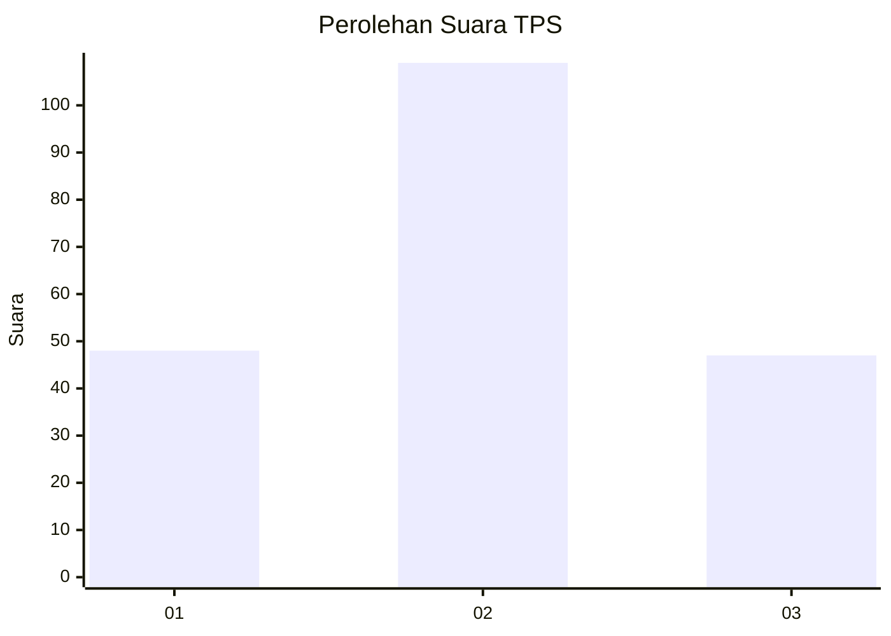
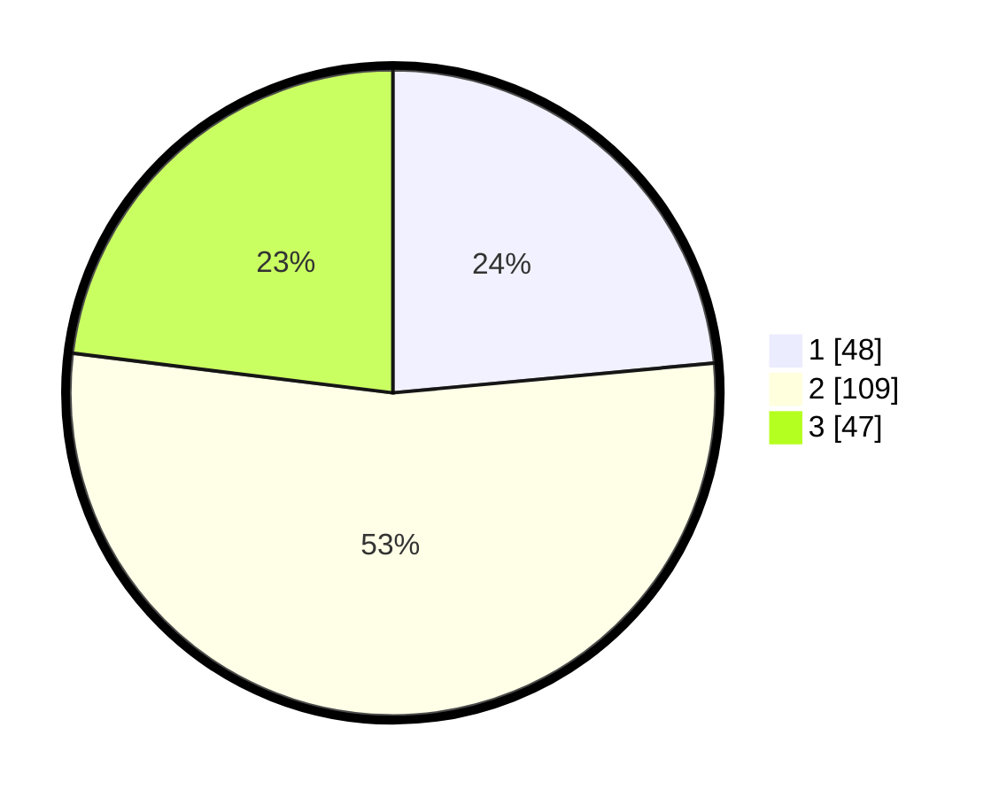

# Hasil

## Grafik

## Tabel

| No. | Nama Paslon    | Suara | Suara (raw) | Persentase |
|:--- |:-------------- | -----:| -----------:| ----------:|
| 1   | ANIES MUHAIMIN | 48    | [48][p-1]   | 23,53      |
| 2   | PRABOWO GIBRAN | 109   | [109][p-2]  | 53,43      |
| 3   | GANJAR MAHFUD  | 47    | [47][p-3]   | 23,04      |

[p-1]: https://github.com/gigit-pemilu/pemilu-2024/blob/main/pilpres/hitung-suara/sub/35-jawa-timur/sub/79-kota-batu/sub/01-batu/sub/1002-ngaglik/sub/004-tps/sub/paslon-1.txt
[p-2]: https://github.com/gigit-pemilu/pemilu-2024/blob/main/pilpres/hitung-suara/sub/35-jawa-timur/sub/79-kota-batu/sub/01-batu/sub/1002-ngaglik/sub/004-tps/sub/paslon-2.txt
[p-3]: https://github.com/gigit-pemilu/pemilu-2024/blob/main/pilpres/hitung-suara/sub/35-jawa-timur/sub/79-kota-batu/sub/01-batu/sub/1002-ngaglik/sub/004-tps/sub/paslon-3.txt

## Foto C Plano

https://sirekap-obj-formc.kpu.go.id/7dd9/pemilu/ppwp/35/79/01/10/02/3579011002004-20240214-201454--e55ef22e-9668-4ae8-9210-5c36af75fde2.jpg

https://sirekap-obj-formc.kpu.go.id/7dd9/pemilu/ppwp/35/79/01/10/02/3579011002004-20240215-011217--3db7df82-d8de-4588-a2cc-50e5e61ec3f4.jpg

https://sirekap-obj-formc.kpu.go.id/7dd9/pemilu/ppwp/35/79/01/10/02/3579011002004-20240214-213737--03f678a2-f8c8-487b-8454-bfb4f16ab037.jpg

## Metadata

| Key        | Value               |
| ---------- | ------------------- |
| Time Stamp | 2024-02-15 17:30:25 |

