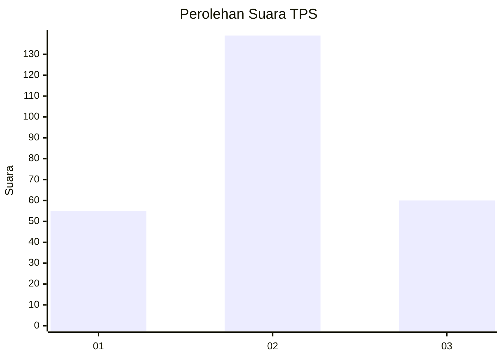
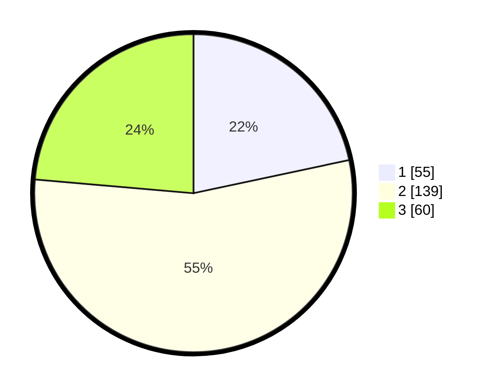

# Hasil

## Grafik

## Tabel

| No. | Nama Paslon    | Suara | Suara (raw) | Persentase |
|:--- |:-------------- | -----:| -----------:| ----------:|
| 1   | ANIES MUHAIMIN | 55    | [55][p-1]   | 21,65      |
| 2   | PRABOWO GIBRAN | 139   | [139][p-2]  | 54,72      |
| 3   | GANJAR MAHFUD  | 60    | [60][p-3]   | 23,62      |

[p-1]: https://github.com/gigit-pemilu/pemilu-2024-35-jawa-timur/blob/main/pilpres/hitung-suara/sub/35-jawa-timur/sub/79-kota-batu/sub/01-batu/sub/1002-ngaglik/sub/008-tps/sub/paslon-1.txt
[p-2]: https://github.com/gigit-pemilu/pemilu-2024-35-jawa-timur/blob/main/pilpres/hitung-suara/sub/35-jawa-timur/sub/79-kota-batu/sub/01-batu/sub/1002-ngaglik/sub/008-tps/sub/paslon-2.txt
[p-3]: https://github.com/gigit-pemilu/pemilu-2024-35-jawa-timur/blob/main/pilpres/hitung-suara/sub/35-jawa-timur/sub/79-kota-batu/sub/01-batu/sub/1002-ngaglik/sub/008-tps/sub/paslon-3.txt

## Foto C Plano

https://sirekap-obj-formc.kpu.go.id/b33b/pemilu/ppwp/35/79/01/10/02/3579011002008-20240214-160132--33ba409a-8bb0-4f13-b08c-a2dd0b1dfe8c.jpg

https://sirekap-obj-formc.kpu.go.id/b33b/pemilu/ppwp/35/79/01/10/02/3579011002008-20240214-212158--453da688-c355-4d4e-871e-c7e1890342bd.jpg

https://sirekap-obj-formc.kpu.go.id/b33b/pemilu/ppwp/35/79/01/10/02/3579011002008-20240214-212208--75d1d8e6-3100-4a88-a54d-d6c41ce2da8e.jpg

## Metadata

| Key        | Value               |
| ---------- | ------------------- |
| Time Stamp | 2024-02-15 20:30:46 |

