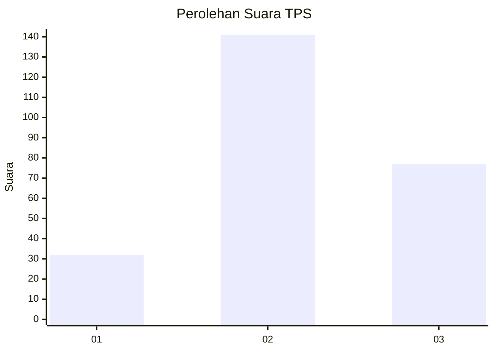
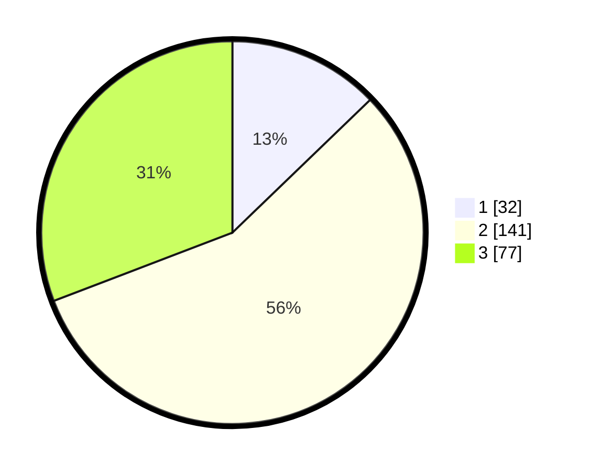

# Hasil

## Grafik

## Tabel

| No. | Nama Paslon    | Suara | Suara (raw) | Persentase |
|:--- |:-------------- | -----:| -----------:| ----------:|
| 1   | ANIES MUHAIMIN | 32    | [32][p-1]   | 12,80      |
| 2   | PRABOWO GIBRAN | 141   | [141][p-2]  | 56,40      |
| 3   | GANJAR MAHFUD  | 77    | [77][p-3]   | 30,80      |

[p-1]: https://github.com/gigit-pemilu/pemilu-2024/blob/main/pilpres/hitung-suara/sub/35-jawa-timur/sub/79-kota-batu/sub/01-batu/sub/1003-songgokerto/sub/008-tps/sub/paslon-1.txt
[p-2]: https://github.com/gigit-pemilu/pemilu-2024/blob/main/pilpres/hitung-suara/sub/35-jawa-timur/sub/79-kota-batu/sub/01-batu/sub/1003-songgokerto/sub/008-tps/sub/paslon-2.txt
[p-3]: https://github.com/gigit-pemilu/pemilu-2024/blob/main/pilpres/hitung-suara/sub/35-jawa-timur/sub/79-kota-batu/sub/01-batu/sub/1003-songgokerto/sub/008-tps/sub/paslon-3.txt

## Foto C Plano

https://sirekap-obj-formc.kpu.go.id/5ec0/pemilu/ppwp/35/79/01/10/03/3579011003008-20240220-102311--2e8746b4-58fe-42b0-903e-067b506397fd.jpg

https://sirekap-obj-formc.kpu.go.id/5ec0/pemilu/ppwp/35/79/01/10/03/3579011003008-20240220-102404--9f714cd3-7ea4-45be-83d5-e24cf31dbaf8.jpg

https://sirekap-obj-formc.kpu.go.id/5ec0/pemilu/ppwp/35/79/01/10/03/3579011003008-20240220-102551--1f48fd0b-110d-46de-947a-2a3233e2c808.jpg

## Metadata

| Key        | Value               |
| ---------- | ------------------- |
| Time Stamp | 2024-02-24 22:31:28 |

