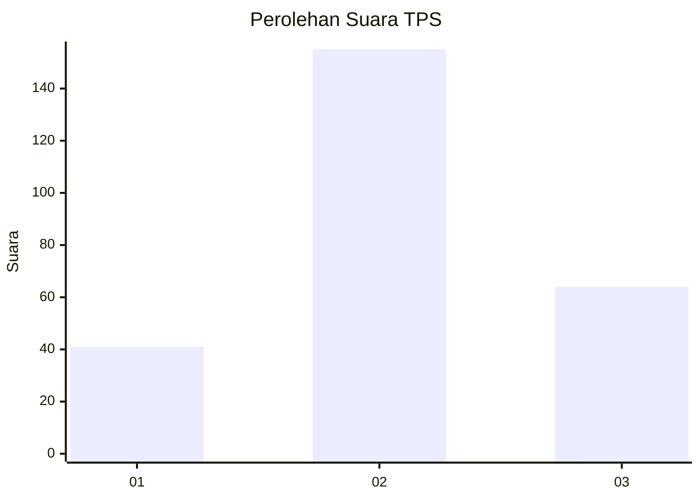
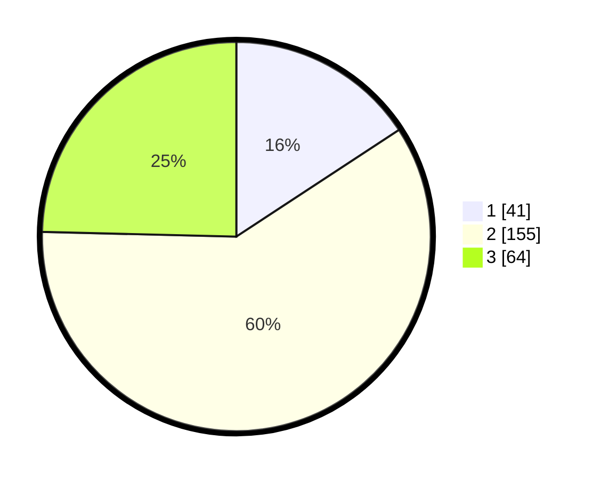

# Hasil

## Grafik

## Tabel

| No. | Nama Paslon    | Suara | Suara (raw) | Persentase |
|:--- |:-------------- | -----:| -----------:| ----------:|
| 1   | ANIES MUHAIMIN | 41    | [41][p-1]   | 15,77      |
| 2   | PRABOWO GIBRAN | 155   | [155][p-2]  | 59,62      |
| 3   | GANJAR MAHFUD  | 64    | [64][p-3]   | 24,62      |

[p-1]: https://github.com/gigit-pemilu/pemilu-2024-35-jawa-timur/blob/main/pilpres/hitung-suara/sub/35-jawa-timur/sub/79-kota-batu/sub/01-batu/sub/1003-songgokerto/sub/010-tps/sub/paslon-1.txt
[p-2]: https://github.com/gigit-pemilu/pemilu-2024-35-jawa-timur/blob/main/pilpres/hitung-suara/sub/35-jawa-timur/sub/79-kota-batu/sub/01-batu/sub/1003-songgokerto/sub/010-tps/sub/paslon-2.txt
[p-3]: https://github.com/gigit-pemilu/pemilu-2024-35-jawa-timur/blob/main/pilpres/hitung-suara/sub/35-jawa-timur/sub/79-kota-batu/sub/01-batu/sub/1003-songgokerto/sub/010-tps/sub/paslon-3.txt

## Foto C Plano

https://sirekap-obj-formc.kpu.go.id/fb1d/pemilu/ppwp/35/79/01/10/03/3579011003010-20240220-101913--5389358f-b3af-4f06-9f36-60d1143d259f.jpg

https://sirekap-obj-formc.kpu.go.id/fb1d/pemilu/ppwp/35/79/01/10/03/3579011003010-20240220-101953--0faf2197-267f-4939-b263-5a97c97dc15c.jpg

https://sirekap-obj-formc.kpu.go.id/fb1d/pemilu/ppwp/35/79/01/10/03/3579011003010-20240220-102042--47bca205-faf0-4e36-8838-648f13620566.jpg

## Metadata

| Key        | Value               |
| ---------- | ------------------- |
| Time Stamp | 2024-02-25 22:00:00 |

