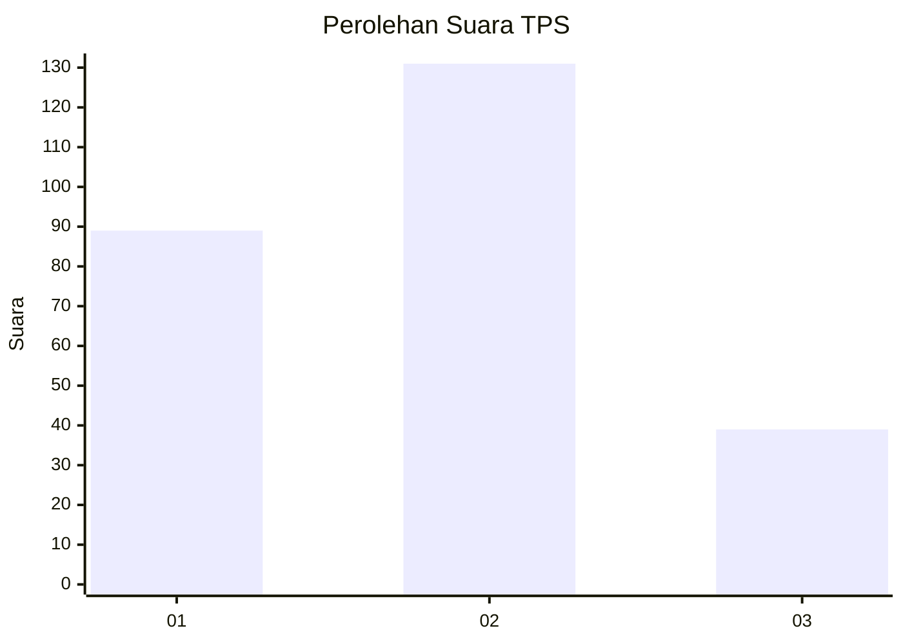
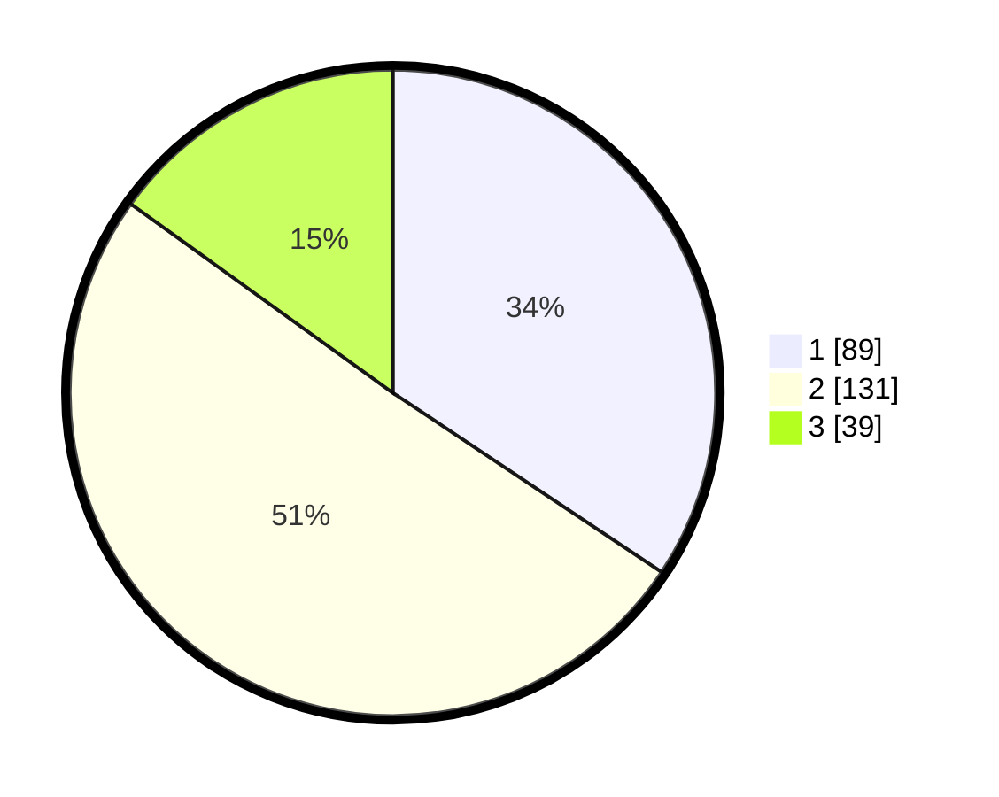

# Hasil

## Grafik

## Tabel

| No. | Nama Paslon    | Suara | Suara (raw) | Persentase |
|:--- |:-------------- | -----:| -----------:| ----------:|
| 1   | ANIES MUHAIMIN | 89    | [89][p-1]   | 34,36      |
| 2   | PRABOWO GIBRAN | 131   | [131][p-2]  | 50,58      |
| 3   | GANJAR MAHFUD  | 39    | [39][p-3]   | 15,06      |

[p-1]: https://github.com/gigit-pemilu/pemilu-2024-35-jawa-timur/blob/main/pilpres/hitung-suara/sub/35-jawa-timur/sub/79-kota-batu/sub/01-batu/sub/1004-sisir/sub/039-tps/sub/paslon-1.txt
[p-2]: https://github.com/gigit-pemilu/pemilu-2024-35-jawa-timur/blob/main/pilpres/hitung-suara/sub/35-jawa-timur/sub/79-kota-batu/sub/01-batu/sub/1004-sisir/sub/039-tps/sub/paslon-2.txt
[p-3]: https://github.com/gigit-pemilu/pemilu-2024-35-jawa-timur/blob/main/pilpres/hitung-suara/sub/35-jawa-timur/sub/79-kota-batu/sub/01-batu/sub/1004-sisir/sub/039-tps/sub/paslon-3.txt

## Foto C Plano

https://sirekap-obj-formc.kpu.go.id/8ecf/pemilu/ppwp/35/79/01/10/04/3579011004039-20240215-033147--a23e441f-ffde-42ee-8975-11410b39f45e.jpg

https://sirekap-obj-formc.kpu.go.id/8ecf/pemilu/ppwp/35/79/01/10/04/3579011004039-20240215-033159--eb576c78-094b-40d2-810c-4eb247bd9a6b.jpg

https://sirekap-obj-formc.kpu.go.id/8ecf/pemilu/ppwp/35/79/01/10/04/3579011004039-20240215-033441--9aca5d76-376d-45bd-b4e5-72dfe0ac5690.jpg

## Metadata

| Key        | Value               |
| ---------- | ------------------- |
| Time Stamp | 2024-02-15 19:30:26 |

