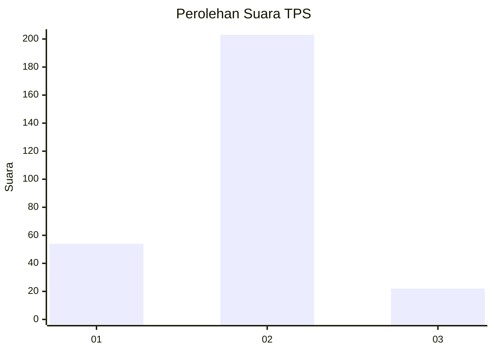
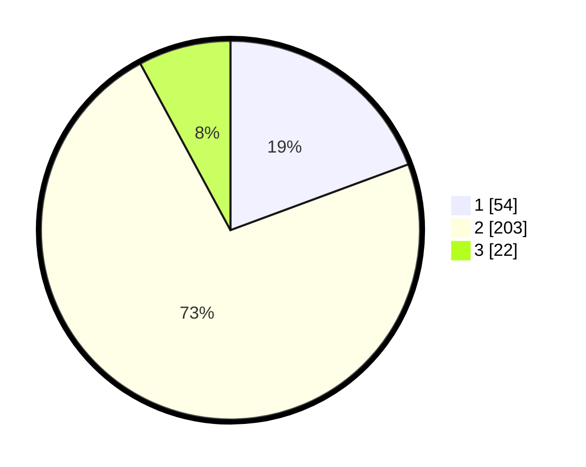

# Hasil

## Grafik

## Tabel

| No. | Nama Paslon    | Suara | Suara (raw) | Persentase |
|:--- |:-------------- | -----:| -----------:| ----------:|
| 1   | ANIES MUHAIMIN | 54    | [54][p-1]   | 19,35      |
| 2   | PRABOWO GIBRAN | 203   | [203][p-2]  | 72,76      |
| 3   | GANJAR MAHFUD  | 22    | [22][p-3]   | 7,89       |

[p-1]: https://github.com/gigit-pemilu/pemilu-2024/blob/main/pilpres/hitung-suara/sub/35-jawa-timur/sub/79-kota-batu/sub/01-batu/sub/2005-sumberejo/sub/016-tps/sub/paslon-1.txt
[p-2]: https://github.com/gigit-pemilu/pemilu-2024/blob/main/pilpres/hitung-suara/sub/35-jawa-timur/sub/79-kota-batu/sub/01-batu/sub/2005-sumberejo/sub/016-tps/sub/paslon-2.txt
[p-3]: https://github.com/gigit-pemilu/pemilu-2024/blob/main/pilpres/hitung-suara/sub/35-jawa-timur/sub/79-kota-batu/sub/01-batu/sub/2005-sumberejo/sub/016-tps/sub/paslon-3.txt

## Foto C Plano

https://sirekap-obj-formc.kpu.go.id/7963/pemilu/ppwp/35/79/01/20/05/3579012005016-20240218-185913--e5812cc5-ae28-4946-b7fa-6f016ad750e5.jpg

https://sirekap-obj-formc.kpu.go.id/7963/pemilu/ppwp/35/79/01/20/05/3579012005016-20240218-190207--2c479229-3040-4d12-9685-3e7941334d37.jpg

https://sirekap-obj-formc.kpu.go.id/7963/pemilu/ppwp/35/79/01/20/05/3579012005016-20240215-001829--8533af63-6efd-4d2b-b8dd-cccc090f9297.jpg

## Metadata

| Key        | Value               |
| ---------- | ------------------- |
| Time Stamp | 2024-02-24 22:31:28 |

