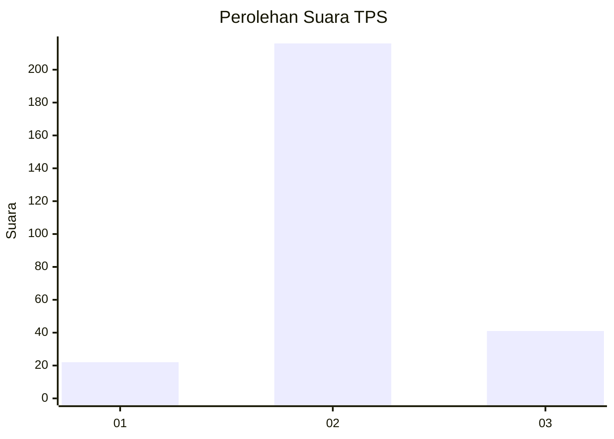

# Hasil

## Grafik

## Tabel

| No. | Nama Paslon    | Suara | Suara (raw) | Persentase |
|:--- |:-------------- | -----:| -----------:| ----------:|
| 1   | ANIES MUHAIMIN | 22    | [22][p-1]   | 7,89       |
| 2   | PRABOWO GIBRAN | 216   | [216][p-2]  | 77,42      |
| 3   | GANJAR MAHFUD  | 41    | [41][p-3]   | 14,70      |

[p-1]: https://github.com/gigit-pemilu/pemilu-2024-35-jawa-timur/blob/main/pilpres/hitung-suara/sub/35-jawa-timur/sub/79-kota-batu/sub/01-batu/sub/2005-sumberejo/sub/017-tps/sub/paslon-1.txt
[p-2]: https://github.com/gigit-pemilu/pemilu-2024-35-jawa-timur/blob/main/pilpres/hitung-suara/sub/35-jawa-timur/sub/79-kota-batu/sub/01-batu/sub/2005-sumberejo/sub/017-tps/sub/paslon-2.txt
[p-3]: https://github.com/gigit-pemilu/pemilu-2024-35-jawa-timur/blob/main/pilpres/hitung-suara/sub/35-jawa-timur/sub/79-kota-batu/sub/01-batu/sub/2005-sumberejo/sub/017-tps/sub/paslon-3.txt

## Foto C Plano

https://sirekap-obj-formc.kpu.go.id/5a1c/pemilu/ppwp/35/79/01/20/05/3579012005017-20240215-000726--3493a1de-1064-4fdf-af63-6dde50e2594c.jpg

https://sirekap-obj-formc.kpu.go.id/5a1c/pemilu/ppwp/35/79/01/20/05/3579012005017-20240215-000852--24e012b5-69be-43fb-81db-e34937015a90.jpg

https://sirekap-obj-formc.kpu.go.id/5a1c/pemilu/ppwp/35/79/01/20/05/3579012005017-20240215-000949--7cdb69a2-932a-4a5b-a197-1f9563d0d2e1.jpg

## Metadata

| Key        | Value               |
| ---------- | ------------------- |
| Time Stamp | 2024-02-15 15:00:29 |

