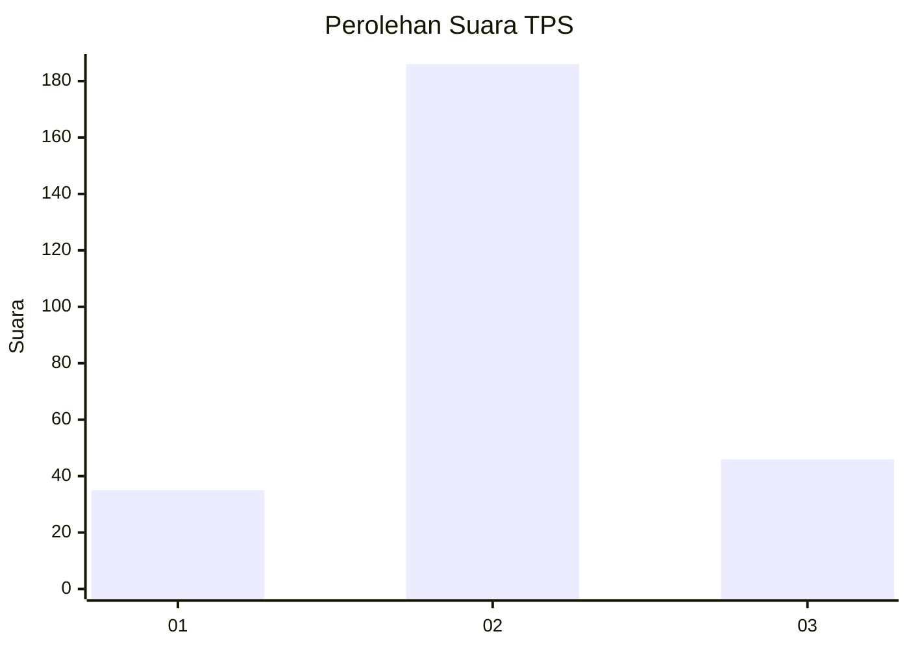
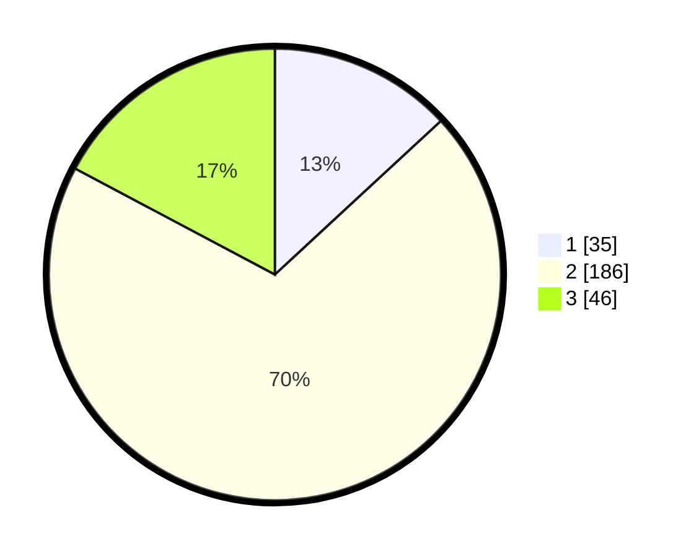

# Hasil

## Grafik

## Tabel

| No. | Nama Paslon    | Suara | Suara (raw) | Persentase |
|:--- |:-------------- | -----:| -----------:| ----------:|
| 1   | ANIES MUHAIMIN | 35    | [35][p-1]   | 13,11      |
| 2   | PRABOWO GIBRAN | 186   | [186][p-2]  | 69,66      |
| 3   | GANJAR MAHFUD  | 46    | [46][p-3]   | 17,23      |

[p-1]: https://github.com/gigit-pemilu/pemilu-2024-35-jawa-timur/blob/main/pilpres/hitung-suara/sub/35-jawa-timur/sub/79-kota-batu/sub/01-batu/sub/2005-sumberejo/sub/018-tps/sub/paslon-1.txt
[p-2]: https://github.com/gigit-pemilu/pemilu-2024-35-jawa-timur/blob/main/pilpres/hitung-suara/sub/35-jawa-timur/sub/79-kota-batu/sub/01-batu/sub/2005-sumberejo/sub/018-tps/sub/paslon-2.txt
[p-3]: https://github.com/gigit-pemilu/pemilu-2024-35-jawa-timur/blob/main/pilpres/hitung-suara/sub/35-jawa-timur/sub/79-kota-batu/sub/01-batu/sub/2005-sumberejo/sub/018-tps/sub/paslon-3.txt

## Foto C Plano

https://sirekap-obj-formc.kpu.go.id/0eea/pemilu/ppwp/35/79/01/20/05/3579012005018-20240220-185550--ceb43e7d-e165-4054-85bf-a3ffb2daaee9.jpg

https://sirekap-obj-formc.kpu.go.id/0eea/pemilu/ppwp/35/79/01/20/05/3579012005018-20240220-185643--5ef37ff2-22a6-4140-9628-523ab973472b.jpg

https://sirekap-obj-formc.kpu.go.id/0eea/pemilu/ppwp/35/79/01/20/05/3579012005018-20240220-185739--109aeeaf-5688-4d05-9d5c-6f19b1b17089.jpg

## Metadata

| Key        | Value               |
| ---------- | ------------------- |
| Time Stamp | 2024-02-25 14:00:00 |

