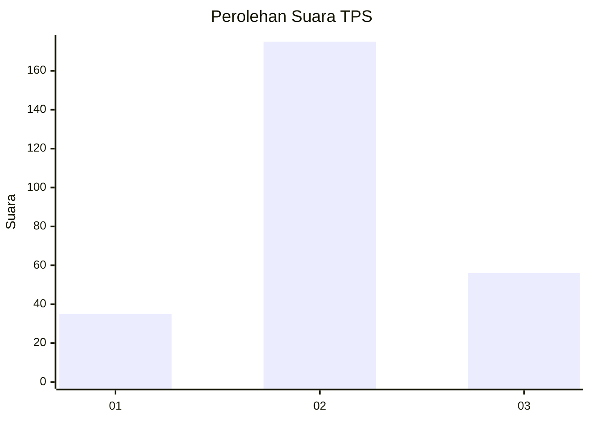
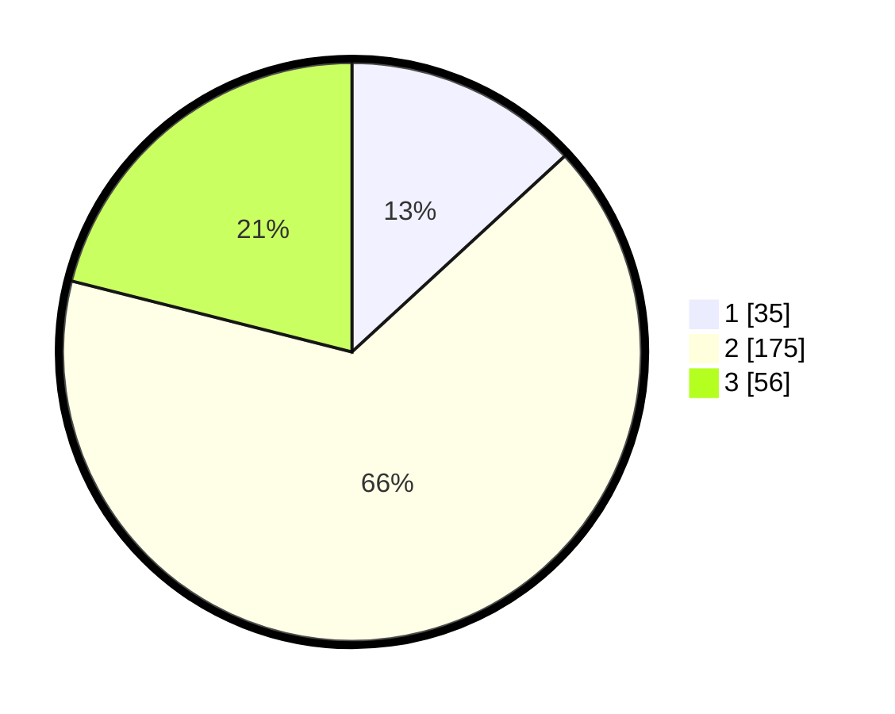

# Hasil

## Grafik

## Tabel

| No. | Nama Paslon    | Suara | Suara (raw) | Persentase |
|:--- |:-------------- | -----:| -----------:| ----------:|
| 1   | ANIES MUHAIMIN | 35    | [35][p-1]   | 13,16      |
| 2   | PRABOWO GIBRAN | 175   | [175][p-2]  | 65,79      |
| 3   | GANJAR MAHFUD  | 56    | [56][p-3]   | 21,05      |

[p-1]: https://github.com/gigit-pemilu/pemilu-2024-35-jawa-timur/blob/main/pilpres/hitung-suara/sub/35-jawa-timur/sub/79-kota-batu/sub/01-batu/sub/2005-sumberejo/sub/019-tps/sub/paslon-1.txt
[p-2]: https://github.com/gigit-pemilu/pemilu-2024-35-jawa-timur/blob/main/pilpres/hitung-suara/sub/35-jawa-timur/sub/79-kota-batu/sub/01-batu/sub/2005-sumberejo/sub/019-tps/sub/paslon-2.txt
[p-3]: https://github.com/gigit-pemilu/pemilu-2024-35-jawa-timur/blob/main/pilpres/hitung-suara/sub/35-jawa-timur/sub/79-kota-batu/sub/01-batu/sub/2005-sumberejo/sub/019-tps/sub/paslon-3.txt

## Foto C Plano

https://sirekap-obj-formc.kpu.go.id/6a8f/pemilu/ppwp/35/79/01/20/05/3579012005019-20240220-193750--4885bfae-0be3-4e1e-9518-795a1c620b7c.jpg

https://sirekap-obj-formc.kpu.go.id/6a8f/pemilu/ppwp/35/79/01/20/05/3579012005019-20240220-193903--78ec4658-2eec-4685-ae31-f1ddb7b16aa3.jpg

https://sirekap-obj-formc.kpu.go.id/6a8f/pemilu/ppwp/35/79/01/20/05/3579012005019-20240220-193907--1aef4c86-bd59-4fc7-877c-00de13bcbc1c.jpg

## Metadata

| Key        | Value               |
| ---------- | ------------------- |
| Time Stamp | 2024-02-25 16:00:00 |

