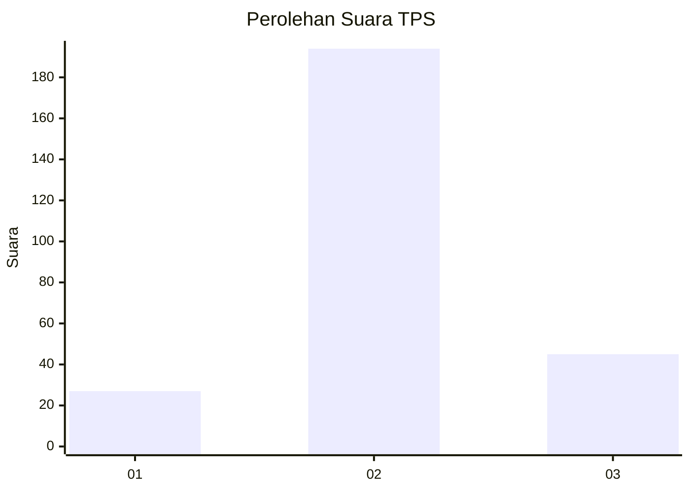
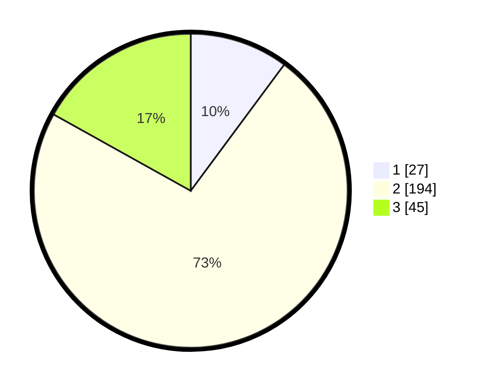

# Hasil

## Grafik

## Tabel

| No. | Nama Paslon    | Suara | Suara (raw) | Persentase |
|:--- |:-------------- | -----:| -----------:| ----------:|
| 1   | ANIES MUHAIMIN | 27    | [27][p-1]   | 10,15      |
| 2   | PRABOWO GIBRAN | 194   | [194][p-2]  | 72,93      |
| 3   | GANJAR MAHFUD  | 45    | [45][p-3]   | 16,92      |

[p-1]: https://github.com/gigit-pemilu/pemilu-2024/blob/main/pilpres/hitung-suara/sub/35-jawa-timur/sub/79-kota-batu/sub/01-batu/sub/2005-sumberejo/sub/021-tps/sub/paslon-1.txt
[p-2]: https://github.com/gigit-pemilu/pemilu-2024/blob/main/pilpres/hitung-suara/sub/35-jawa-timur/sub/79-kota-batu/sub/01-batu/sub/2005-sumberejo/sub/021-tps/sub/paslon-2.txt
[p-3]: https://github.com/gigit-pemilu/pemilu-2024/blob/main/pilpres/hitung-suara/sub/35-jawa-timur/sub/79-kota-batu/sub/01-batu/sub/2005-sumberejo/sub/021-tps/sub/paslon-3.txt

## Foto C Plano

https://sirekap-obj-formc.kpu.go.id/042b/pemilu/ppwp/35/79/01/20/05/3579012005021-20240215-091247--1a95ac45-5398-4e90-a44a-7851d9630f55.jpg

https://sirekap-obj-formc.kpu.go.id/042b/pemilu/ppwp/35/79/01/20/05/3579012005021-20240215-091252--a5ece3dd-d476-47cd-afda-08b2dd51d99c.jpg

https://sirekap-obj-formc.kpu.go.id/042b/pemilu/ppwp/35/79/01/20/05/3579012005021-20240215-091302--b0c4752d-75db-4608-b44e-331e22b4e80f.jpg

## Metadata

| Key        | Value               |
| ---------- | ------------------- |
| Time Stamp | 2024-02-17 12:00:00 |

