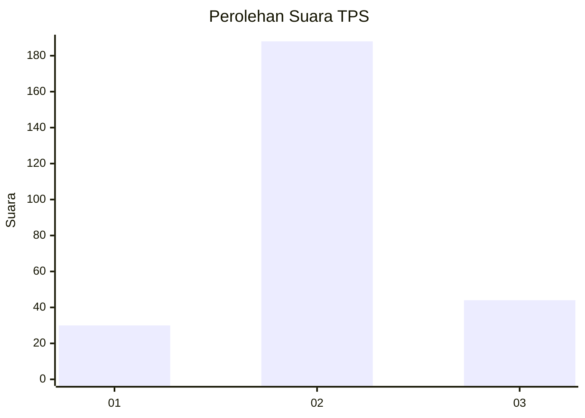
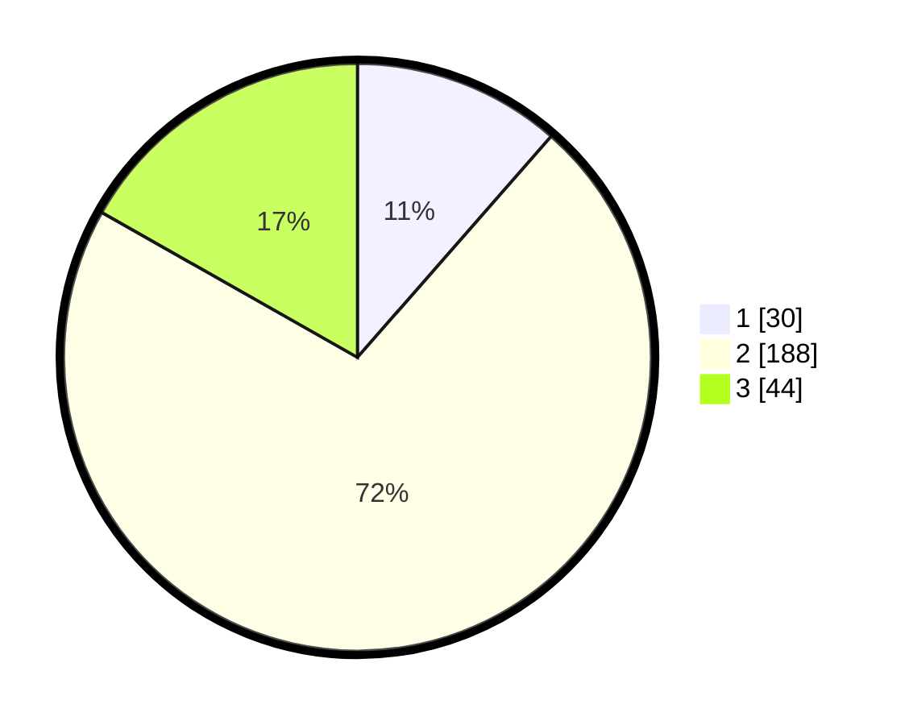

# Hasil

## Grafik

## Tabel

| No. | Nama Paslon    | Suara | Suara (raw) | Persentase |
|:--- |:-------------- | -----:| -----------:| ----------:|
| 1   | ANIES MUHAIMIN | 30    | [30][p-1]   | 11,45      |
| 2   | PRABOWO GIBRAN | 188   | [188][p-2]  | 71,76      |
| 3   | GANJAR MAHFUD  | 44    | [44][p-3]   | 16,79      |

[p-1]: https://github.com/gigit-pemilu/pemilu-2024/blob/main/pilpres/hitung-suara/sub/35-jawa-timur/sub/79-kota-batu/sub/01-batu/sub/2006-oro-oro-ombo/sub/001-tps/sub/paslon-1.txt
[p-2]: https://github.com/gigit-pemilu/pemilu-2024/blob/main/pilpres/hitung-suara/sub/35-jawa-timur/sub/79-kota-batu/sub/01-batu/sub/2006-oro-oro-ombo/sub/001-tps/sub/paslon-2.txt
[p-3]: https://github.com/gigit-pemilu/pemilu-2024/blob/main/pilpres/hitung-suara/sub/35-jawa-timur/sub/79-kota-batu/sub/01-batu/sub/2006-oro-oro-ombo/sub/001-tps/sub/paslon-3.txt

## Foto C Plano

https://sirekap-obj-formc.kpu.go.id/318a/pemilu/ppwp/35/79/01/20/06/3579012006001-20240220-200811--7b5ba7db-aebe-4cff-9bf1-ca3f1b239229.jpg

https://sirekap-obj-formc.kpu.go.id/318a/pemilu/ppwp/35/79/01/20/06/3579012006001-20240220-201003--960d918e-3341-4245-a70c-75e78b9cecea.jpg

https://sirekap-obj-formc.kpu.go.id/318a/pemilu/ppwp/35/79/01/20/06/3579012006001-20240220-200853--d2b1ecda-1ebd-49b3-b49a-40367793cab0.jpg

## Metadata

| Key        | Value               |
| ---------- | ------------------- |
| Time Stamp | 2024-02-26 13:00:00 |

