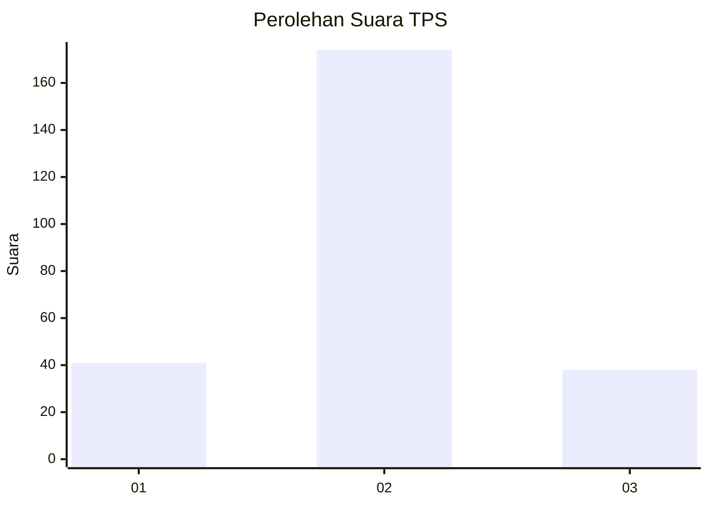

# Hasil

## Grafik

## Tabel

| No. | Nama Paslon    | Suara | Suara (raw) | Persentase |
|:--- |:-------------- | -----:| -----------:| ----------:|
| 1   | ANIES MUHAIMIN | 41    | [41][p-1]   | 16,21      |
| 2   | PRABOWO GIBRAN | 174   | [174][p-2]  | 68,77      |
| 3   | GANJAR MAHFUD  | 38    | [38][p-3]   | 15,02      |

[p-1]: https://github.com/gigit-pemilu/pemilu-2024/blob/main/pilpres/hitung-suara/sub/35-jawa-timur/sub/79-kota-batu/sub/01-batu/sub/2006-oro-oro-ombo/sub/003-tps/sub/paslon-1.txt
[p-2]: https://github.com/gigit-pemilu/pemilu-2024/blob/main/pilpres/hitung-suara/sub/35-jawa-timur/sub/79-kota-batu/sub/01-batu/sub/2006-oro-oro-ombo/sub/003-tps/sub/paslon-2.txt
[p-3]: https://github.com/gigit-pemilu/pemilu-2024/blob/main/pilpres/hitung-suara/sub/35-jawa-timur/sub/79-kota-batu/sub/01-batu/sub/2006-oro-oro-ombo/sub/003-tps/sub/paslon-3.txt

## Foto C Plano

https://sirekap-obj-formc.kpu.go.id/4e7e/pemilu/ppwp/35/79/01/20/06/3579012006003-20240215-012617--666d479f-f908-4b75-98e0-d7895cf63c71.jpg

https://sirekap-obj-formc.kpu.go.id/4e7e/pemilu/ppwp/35/79/01/20/06/3579012006003-20240215-012735--ee6ef3c4-53d6-4456-8329-d2826ba426ac.jpg

https://sirekap-obj-formc.kpu.go.id/4e7e/pemilu/ppwp/35/79/01/20/06/3579012006003-20240215-022259--297738c1-4605-43bd-9a50-13389c857306.jpg

## Metadata

| Key        | Value               |
| ---------- | ------------------- |
| Time Stamp | 2024-02-15 19:30:26 |

