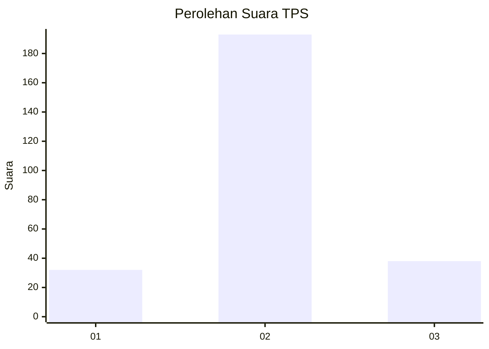
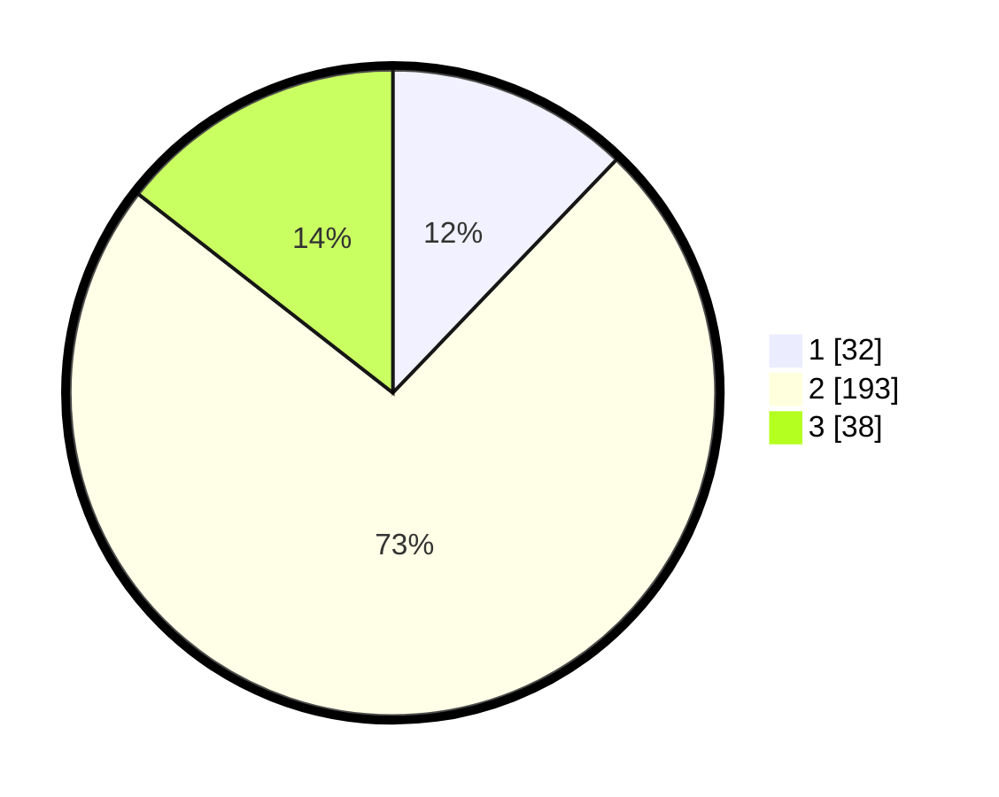

# Hasil

## Grafik

## Tabel

| No. | Nama Paslon    | Suara | Suara (raw) | Persentase |
|:--- |:-------------- | -----:| -----------:| ----------:|
| 1   | ANIES MUHAIMIN | 32    | [32][p-1]   | 12,17      |
| 2   | PRABOWO GIBRAN | 193   | [193][p-2]  | 73,38      |
| 3   | GANJAR MAHFUD  | 38    | [38][p-3]   | 14,45      |

[p-1]: https://github.com/gigit-pemilu/pemilu-2024/blob/main/pilpres/hitung-suara/sub/35-jawa-timur/sub/79-kota-batu/sub/01-batu/sub/2006-oro-oro-ombo/sub/004-tps/sub/paslon-1.txt
[p-2]: https://github.com/gigit-pemilu/pemilu-2024/blob/main/pilpres/hitung-suara/sub/35-jawa-timur/sub/79-kota-batu/sub/01-batu/sub/2006-oro-oro-ombo/sub/004-tps/sub/paslon-2.txt
[p-3]: https://github.com/gigit-pemilu/pemilu-2024/blob/main/pilpres/hitung-suara/sub/35-jawa-timur/sub/79-kota-batu/sub/01-batu/sub/2006-oro-oro-ombo/sub/004-tps/sub/paslon-3.txt

## Foto C Plano

https://sirekap-obj-formc.kpu.go.id/1ae0/pemilu/ppwp/35/79/01/20/06/3579012006004-20240220-230041--89c7aad9-4af6-4455-9ccc-c053247c6a06.jpg

https://sirekap-obj-formc.kpu.go.id/1ae0/pemilu/ppwp/35/79/01/20/06/3579012006004-20240220-230135--d36ea3cf-9464-4e5b-8e81-9fa6181e1e21.jpg

https://sirekap-obj-formc.kpu.go.id/1ae0/pemilu/ppwp/35/79/01/20/06/3579012006004-20240220-230226--7a7a3cdb-b949-4a34-b988-f6df23e34039.jpg

## Metadata

| Key        | Value               |
| ---------- | ------------------- |
| Time Stamp | 2024-02-25 11:00:00 |

