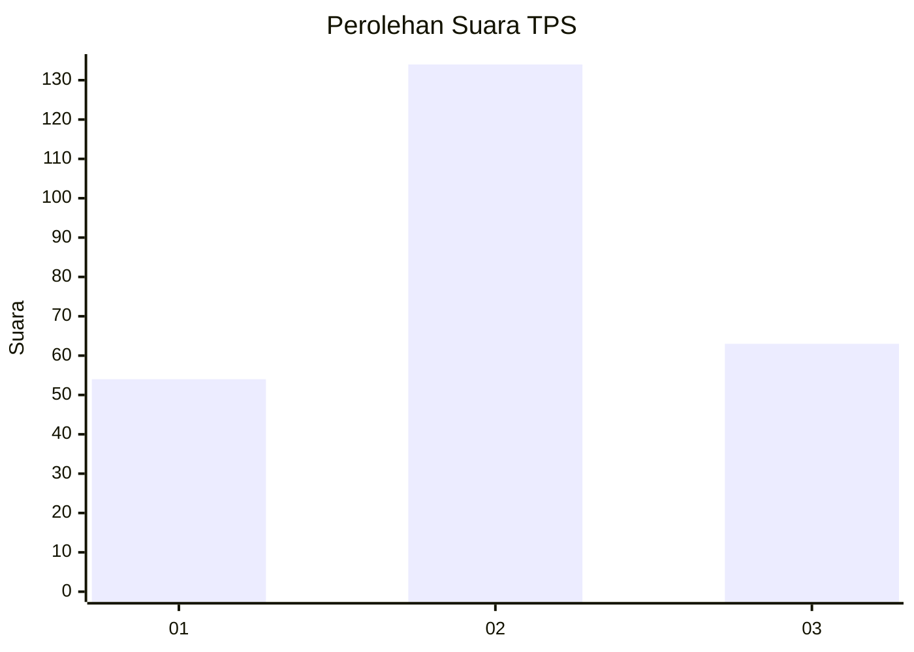
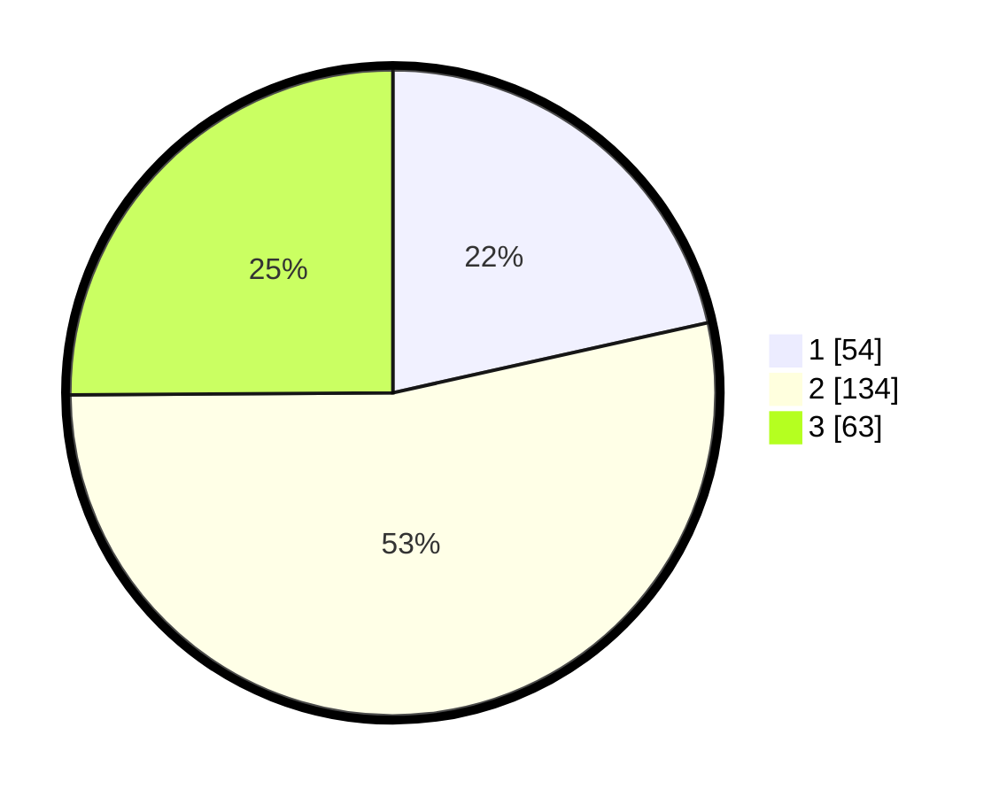

# Hasil

## Grafik

## Tabel

| No. | Nama Paslon    | Suara | Suara (raw) | Persentase |
|:--- |:-------------- | -----:| -----------:| ----------:|
| 1   | ANIES MUHAIMIN | 54    | [54][p-1]   | 21,51      |
| 2   | PRABOWO GIBRAN | 134   | [134][p-2]  | 53,39      |
| 3   | GANJAR MAHFUD  | 63    | [63][p-3]   | 25,10      |

[p-1]: https://github.com/gigit-pemilu/pemilu-2024/blob/main/pilpres/hitung-suara/sub/35-jawa-timur/sub/79-kota-batu/sub/01-batu/sub/2008-pesanggrahan/sub/015-tps/sub/paslon-1.txt
[p-2]: https://github.com/gigit-pemilu/pemilu-2024/blob/main/pilpres/hitung-suara/sub/35-jawa-timur/sub/79-kota-batu/sub/01-batu/sub/2008-pesanggrahan/sub/015-tps/sub/paslon-2.txt
[p-3]: https://github.com/gigit-pemilu/pemilu-2024/blob/main/pilpres/hitung-suara/sub/35-jawa-timur/sub/79-kota-batu/sub/01-batu/sub/2008-pesanggrahan/sub/015-tps/sub/paslon-3.txt

## Foto C Plano

https://sirekap-obj-formc.kpu.go.id/40f2/pemilu/ppwp/35/79/01/20/08/3579012008015-20240220-224953--b91317f5-34e4-4515-a02c-94c45e6563c2.jpg

https://sirekap-obj-formc.kpu.go.id/40f2/pemilu/ppwp/35/79/01/20/08/3579012008015-20240220-225028--0aa2f52d-b12e-4417-b2c8-8f924b15dff9.jpg

https://sirekap-obj-formc.kpu.go.id/40f2/pemilu/ppwp/35/79/01/20/08/3579012008015-20240220-225057--adcba952-87f6-4eed-af3e-83cd5a73e70b.jpg

## Metadata

| Key        | Value               |
| ---------- | ------------------- |
| Time Stamp | 2024-02-25 15:00:00 |

