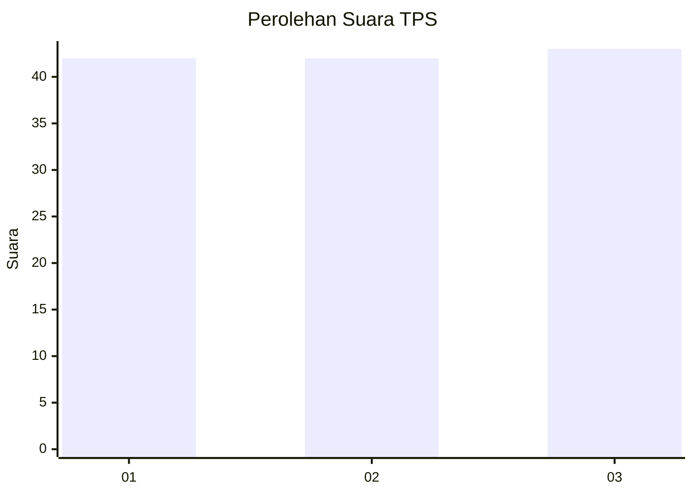
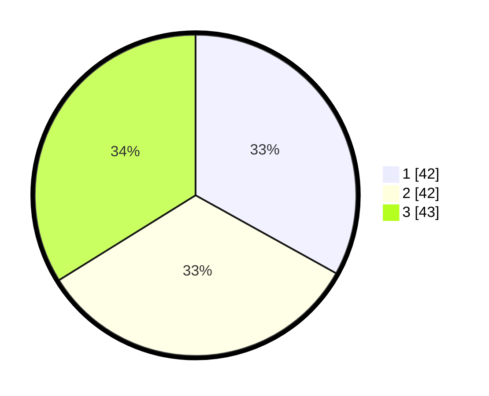

# Hasil

## Grafik

## Tabel

| No. | Nama Paslon    | Suara | Suara (raw) | Persentase |
|:--- |:-------------- | -----:| -----------:| ----------:|
| 1   | ANIES MUHAIMIN | 42    | [42][p-1]   | 33,07      |
| 2   | PRABOWO GIBRAN | 42    | [42][p-2]   | 33,07      |
| 3   | GANJAR MAHFUD  | 43    | [43][p-3]   | 33,86      |

[p-1]: https://github.com/gigit-pemilu/pemilu-2024-35-jawa-timur/blob/main/pilpres/hitung-suara/sub/35-jawa-timur/sub/79-kota-batu/sub/01-batu/sub/2008-pesanggrahan/sub/017-tps/sub/paslon-1.txt
[p-2]: https://github.com/gigit-pemilu/pemilu-2024-35-jawa-timur/blob/main/pilpres/hitung-suara/sub/35-jawa-timur/sub/79-kota-batu/sub/01-batu/sub/2008-pesanggrahan/sub/017-tps/sub/paslon-2.txt
[p-3]: https://github.com/gigit-pemilu/pemilu-2024-35-jawa-timur/blob/main/pilpres/hitung-suara/sub/35-jawa-timur/sub/79-kota-batu/sub/01-batu/sub/2008-pesanggrahan/sub/017-tps/sub/paslon-3.txt

## Foto C Plano

https://sirekap-obj-formc.kpu.go.id/6c75/pemilu/ppwp/35/79/01/20/08/3579012008017-20240218-113947--521b4226-dccb-4e1c-a2b0-323129868d12.jpg

https://sirekap-obj-formc.kpu.go.id/6c75/pemilu/ppwp/35/79/01/20/08/3579012008017-20240218-114022--55bb669f-aec2-470f-95fe-7c660f4272d2.jpg

https://sirekap-obj-formc.kpu.go.id/6c75/pemilu/ppwp/35/79/01/20/08/3579012008017-20240218-114155--1826831a-6ec2-4161-a927-c0f0e734f484.jpg

## Metadata

| Key        | Value               |
| ---------- | ------------------- |
| Time Stamp | 2024-02-19 06:16:00 |

