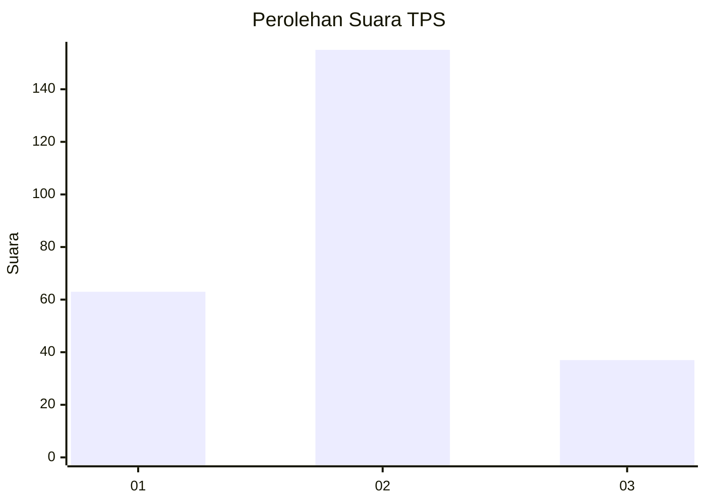
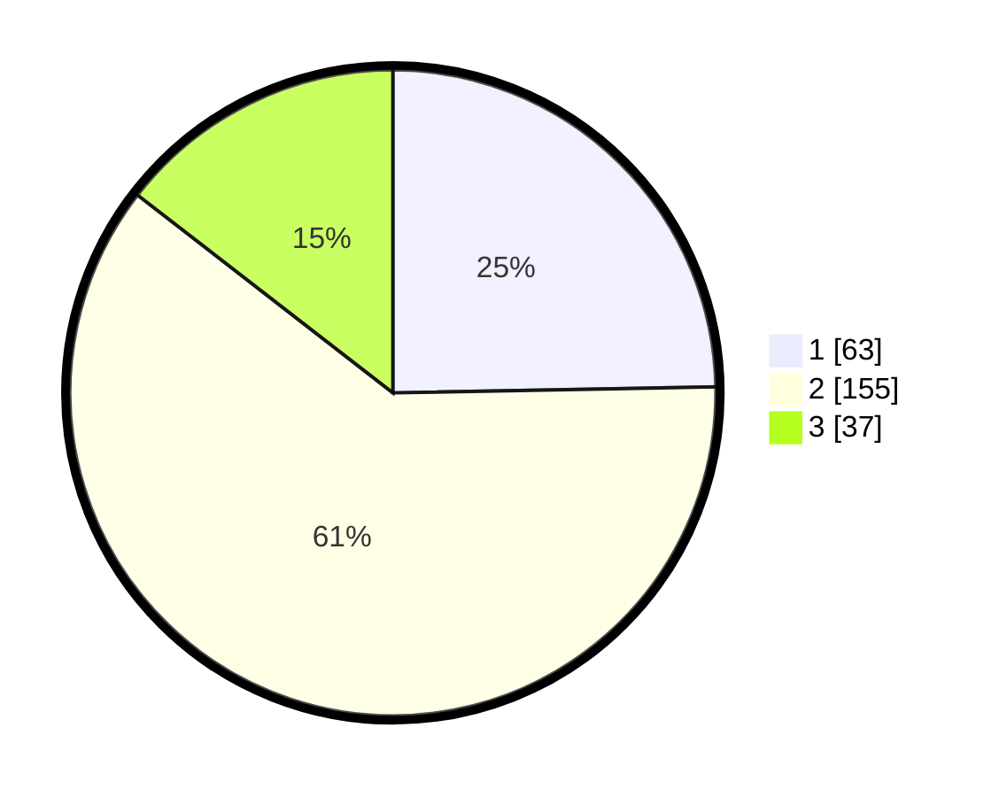

# Hasil

## Grafik

## Tabel

| No. | Nama Paslon    | Suara | Suara (raw) | Persentase |
|:--- |:-------------- | -----:| -----------:| ----------:|
| 1   | ANIES MUHAIMIN | 63    | [63][p-1]   | 24,71      |
| 2   | PRABOWO GIBRAN | 155   | [155][p-2]  | 60,78      |
| 3   | GANJAR MAHFUD  | 37    | [37][p-3]   | 14,51      |

[p-1]: https://github.com/gigit-pemilu/pemilu-2024-35-jawa-timur/blob/main/pilpres/hitung-suara/sub/35-jawa-timur/sub/79-kota-batu/sub/01-batu/sub/2008-pesanggrahan/sub/035-tps/sub/paslon-1.txt
[p-2]: https://github.com/gigit-pemilu/pemilu-2024-35-jawa-timur/blob/main/pilpres/hitung-suara/sub/35-jawa-timur/sub/79-kota-batu/sub/01-batu/sub/2008-pesanggrahan/sub/035-tps/sub/paslon-2.txt
[p-3]: https://github.com/gigit-pemilu/pemilu-2024-35-jawa-timur/blob/main/pilpres/hitung-suara/sub/35-jawa-timur/sub/79-kota-batu/sub/01-batu/sub/2008-pesanggrahan/sub/035-tps/sub/paslon-3.txt

## Foto C Plano

https://sirekap-obj-formc.kpu.go.id/1371/pemilu/ppwp/35/79/01/20/08/3579012008035-20240218-181912--f02a21c4-4b9a-4a72-b70e-f65a83d9bd7f.jpg

https://sirekap-obj-formc.kpu.go.id/1371/pemilu/ppwp/35/79/01/20/08/3579012008035-20240218-181932--e34870e6-6b29-4b69-b422-3ab0496f725c.jpg

https://sirekap-obj-formc.kpu.go.id/1371/pemilu/ppwp/35/79/01/20/08/3579012008035-20240218-182119--aa1c8689-aa71-4801-9256-c6097444710a.jpg

## Metadata

| Key        | Value               |
| ---------- | ------------------- |
| Time Stamp | 2024-02-19 06:16:00 |

