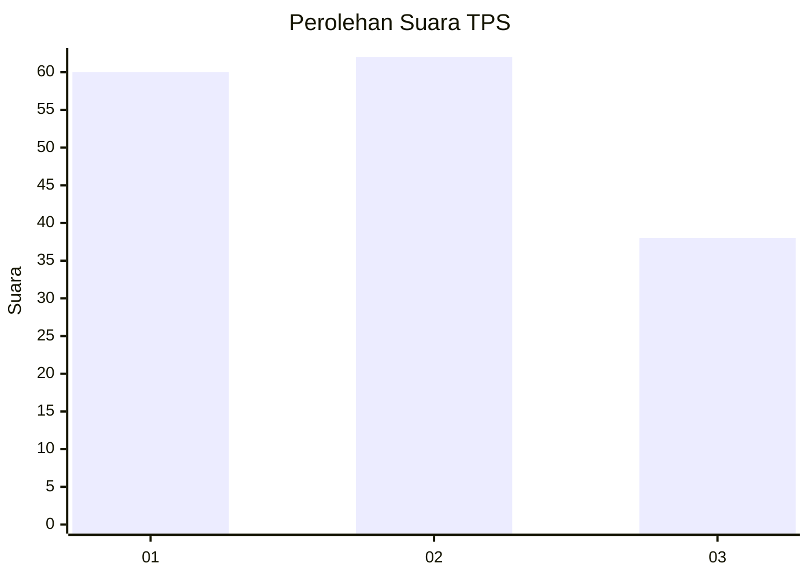
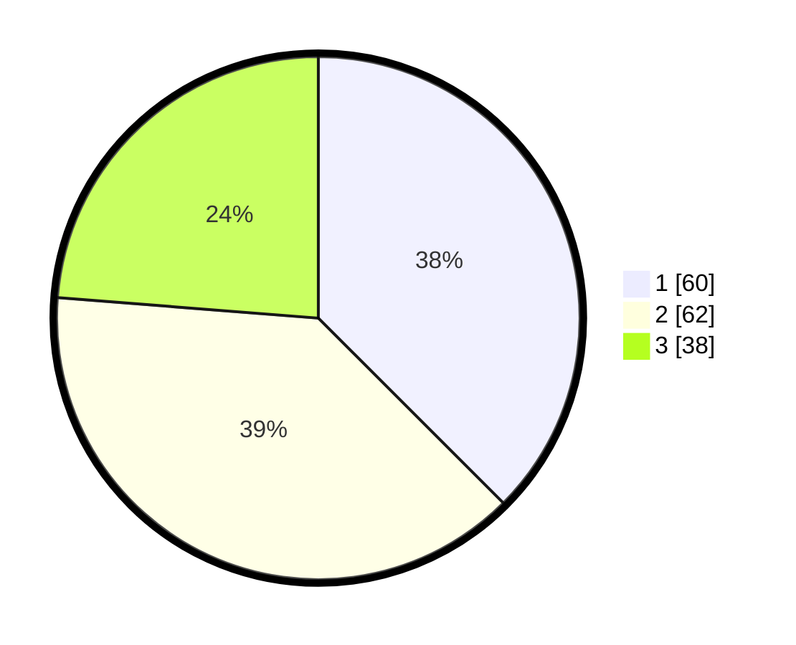

# Hasil

## Grafik

## Tabel

| No. | Nama Paslon    | Suara | Suara (raw) | Persentase |
|:--- |:-------------- | -----:| -----------:| ----------:|
| 1   | ANIES MUHAIMIN | 60    | [60][p-1]   | 37,50      |
| 2   | PRABOWO GIBRAN | 62    | [62][p-2]   | 38,75      |
| 3   | GANJAR MAHFUD  | 38    | [38][p-3]   | 23,75      |

[p-1]: https://github.com/gigit-pemilu/pemilu-2024/blob/main/pilpres/hitung-suara/sub/35-jawa-timur/sub/79-kota-batu/sub/01-batu/sub/2008-pesanggrahan/sub/036-tps/sub/paslon-1.txt
[p-2]: https://github.com/gigit-pemilu/pemilu-2024/blob/main/pilpres/hitung-suara/sub/35-jawa-timur/sub/79-kota-batu/sub/01-batu/sub/2008-pesanggrahan/sub/036-tps/sub/paslon-2.txt
[p-3]: https://github.com/gigit-pemilu/pemilu-2024/blob/main/pilpres/hitung-suara/sub/35-jawa-timur/sub/79-kota-batu/sub/01-batu/sub/2008-pesanggrahan/sub/036-tps/sub/paslon-3.txt

## Foto C Plano

https://sirekap-obj-formc.kpu.go.id/2865/pemilu/ppwp/35/79/01/20/08/3579012008036-20240218-190642--1a883465-7178-47d3-b8e0-c972872d549e.jpg

https://sirekap-obj-formc.kpu.go.id/2865/pemilu/ppwp/35/79/01/20/08/3579012008036-20240218-190802--d4170edc-3681-40c6-993a-ff151808c2f9.jpg

https://sirekap-obj-formc.kpu.go.id/2865/pemilu/ppwp/35/79/01/20/08/3579012008036-20240218-190841--d4fc9773-55cb-4ae7-a25c-00745d84c3ea.jpg

## Metadata

| Key        | Value               |
| ---------- | ------------------- |
| Time Stamp | 2024-02-19 06:16:00 |

