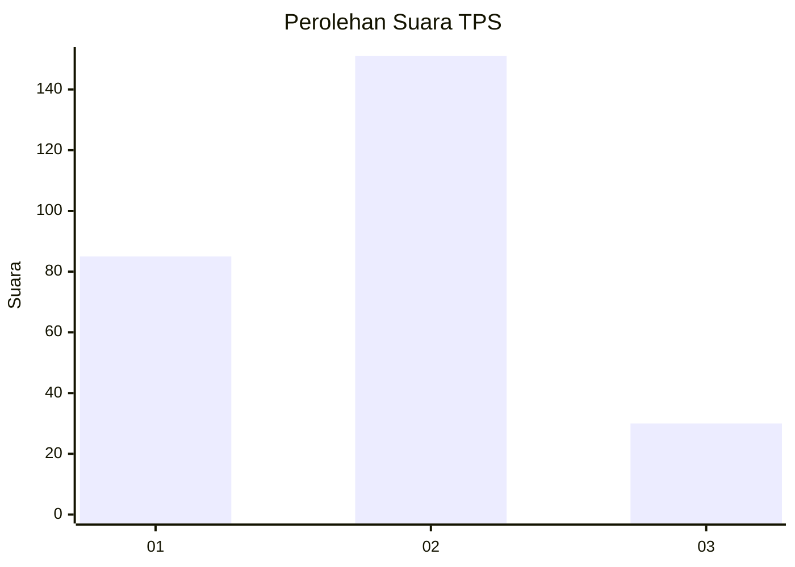
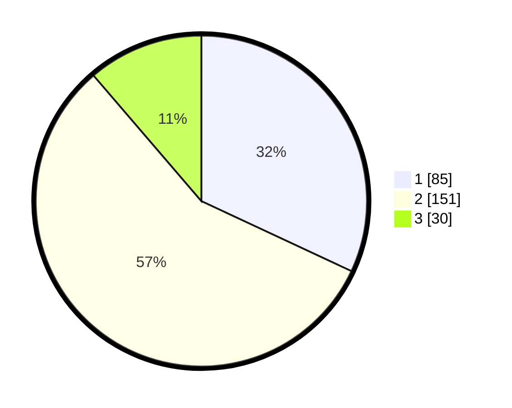

# Hasil

## Grafik

## Tabel

| No. | Nama Paslon    | Suara | Suara (raw) | Persentase |
|:--- |:-------------- | -----:| -----------:| ----------:|
| 1   | ANIES MUHAIMIN | 85    | [85][p-1]   | 31,95      |
| 2   | PRABOWO GIBRAN | 151   | [151][p-2]  | 56,77      |
| 3   | GANJAR MAHFUD  | 30    | [30][p-3]   | 11,28      |

[p-1]: https://github.com/gigit-pemilu/pemilu-2024-35-jawa-timur/blob/main/pilpres/hitung-suara/sub/35-jawa-timur/sub/79-kota-batu/sub/01-batu/sub/2008-pesanggrahan/sub/037-tps/sub/paslon-1.txt
[p-2]: https://github.com/gigit-pemilu/pemilu-2024-35-jawa-timur/blob/main/pilpres/hitung-suara/sub/35-jawa-timur/sub/79-kota-batu/sub/01-batu/sub/2008-pesanggrahan/sub/037-tps/sub/paslon-2.txt
[p-3]: https://github.com/gigit-pemilu/pemilu-2024-35-jawa-timur/blob/main/pilpres/hitung-suara/sub/35-jawa-timur/sub/79-kota-batu/sub/01-batu/sub/2008-pesanggrahan/sub/037-tps/sub/paslon-3.txt

## Foto C Plano

https://sirekap-obj-formc.kpu.go.id/fced/pemilu/ppwp/35/79/01/20/08/3579012008037-20240215-005400--2a6ef191-5b9c-4bea-b3b8-c8d13808407e.jpg

https://sirekap-obj-formc.kpu.go.id/fced/pemilu/ppwp/35/79/01/20/08/3579012008037-20240216-133800--c3137232-6308-4d02-85ca-ee940bd5542a.jpg

https://sirekap-obj-formc.kpu.go.id/fced/pemilu/ppwp/35/79/01/20/08/3579012008037-20240215-010201--e5e16d83-deb1-4a5d-80a4-d174485d6a83.jpg

## Metadata

| Key        | Value               |
| ---------- | ------------------- |
| Time Stamp | 2024-02-16 22:01:00 |

