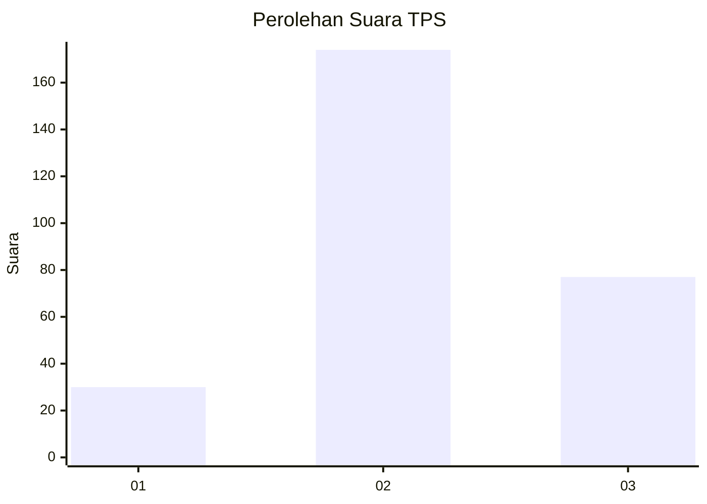
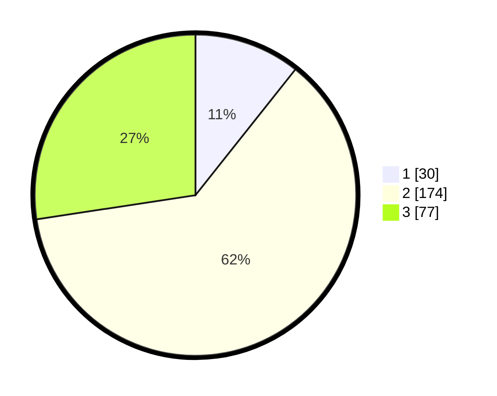

# Hasil

## Grafik

## Tabel

| No. | Nama Paslon    | Suara | Suara (raw) | Persentase |
|:--- |:-------------- | -----:| -----------:| ----------:|
| 1   | ANIES MUHAIMIN | 30    | [30][p-1]   | 10,68      |
| 2   | PRABOWO GIBRAN | 174   | [174][p-2]  | 61,92      |
| 3   | GANJAR MAHFUD  | 77    | [77][p-3]   | 27,40      |

[p-1]: https://github.com/gigit-pemilu/pemilu-2024-35-jawa-timur/blob/main/pilpres/hitung-suara/sub/35-jawa-timur/sub/79-kota-batu/sub/02-bumiaji/sub/2001-punten/sub/003-tps/sub/paslon-1.txt
[p-2]: https://github.com/gigit-pemilu/pemilu-2024-35-jawa-timur/blob/main/pilpres/hitung-suara/sub/35-jawa-timur/sub/79-kota-batu/sub/02-bumiaji/sub/2001-punten/sub/003-tps/sub/paslon-2.txt
[p-3]: https://github.com/gigit-pemilu/pemilu-2024-35-jawa-timur/blob/main/pilpres/hitung-suara/sub/35-jawa-timur/sub/79-kota-batu/sub/02-bumiaji/sub/2001-punten/sub/003-tps/sub/paslon-3.txt

## Foto C Plano

https://sirekap-obj-formc.kpu.go.id/b116/pemilu/ppwp/35/79/02/20/01/3579022001003-20240216-144210--235e6ab5-5993-46e9-bc4f-fd8a8749a005.jpg

https://sirekap-obj-formc.kpu.go.id/b116/pemilu/ppwp/35/79/02/20/01/3579022001003-20240216-144318--613c67bb-893b-476b-b0c7-ce4915a7fccd.jpg

https://sirekap-obj-formc.kpu.go.id/b116/pemilu/ppwp/35/79/02/20/01/3579022001003-20240216-144352--43d39e5e-2b88-4e4a-8600-f4e29a0461cb.jpg

## Metadata

| Key        | Value               |
| ---------- | ------------------- |
| Time Stamp | 2024-02-16 16:25:10 |

## DATA PEMILIH TETAP

Jumlah pemilih dalam DPT: **270**.
 * L: **129**.
 * P: **191**.

## DATA PENGGUNA HAK PILIH

Jumlah pengguna hak pilih dalam DPT: **242**.
 * L: **114**.
 * P: **122**.

Jumlah pengguna hak pilih dalam DPTb: **9**.
 * L: **1**.
 * P: **3**.

Jumlah pengguna hak pilih dalam DPK: **2**.
 * L: **1**.
 * P: **1**.

Jumlah pengguna hak pilih: **298**.
 * L: **116**.
 * P: **132**.

## JUMLAH SUARA SAH DAN TIDAK SAH

JUMLAH SELURUH SUARA SAH: **271**.

JUMLAH SUARA TIDAK SAH: **7**.

JUMLAH SELURUH SUARA SAH DAN SUARA TIDAK SAH: **272**.

