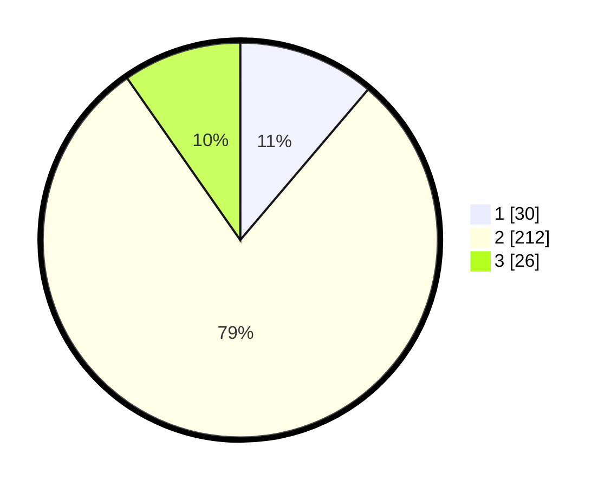

# Hasil

## Grafik

## Tabel

| No. | Nama Paslon    | Suara | Suara (raw) | Persentase |
|:--- |:-------------- | -----:| -----------:| ----------:|
| 1   | ANIES MUHAIMIN | 30    | [30][p-1]   | 11,19      |
| 2   | PRABOWO GIBRAN | 212   | [212][p-2]  | 79,10      |
| 3   | GANJAR MAHFUD  | 26    | [26][p-3]   | 9,70       |

[p-1]: https://github.com/gigit-pemilu/pemilu-2024/blob/main/pilpres/hitung-suara/sub/35-jawa-timur/sub/79-kota-batu/sub/02-bumiaji/sub/2001-punten/sub/015-tps/sub/paslon-1.txt
[p-2]: https://github.com/gigit-pemilu/pemilu-2024/blob/main/pilpres/hitung-suara/sub/35-jawa-timur/sub/79-kota-batu/sub/02-bumiaji/sub/2001-punten/sub/015-tps/sub/paslon-2.txt
[p-3]: https://github.com/gigit-pemilu/pemilu-2024/blob/main/pilpres/hitung-suara/sub/35-jawa-timur/sub/79-kota-batu/sub/02-bumiaji/sub/2001-punten/sub/015-tps/sub/paslon-3.txt

## Foto C Plano

https://sirekap-obj-formc.kpu.go.id/9d00/pemilu/ppwp/35/79/02/20/01/3579022001015-20240217-164201--fe6798e6-ab02-4632-b39f-af3bd6b00759.jpg

https://sirekap-obj-formc.kpu.go.id/9d00/pemilu/ppwp/35/79/02/20/01/3579022001015-20240217-164227--b327ef46-56af-45b2-9f87-c99123c1dfaa.jpg

https://sirekap-obj-formc.kpu.go.id/9d00/pemilu/ppwp/35/79/02/20/01/3579022001015-20240217-164250--104dd051-0303-4d22-b638-69b69a4dcb4a.jpg

## Metadata

| Key        | Value               |
| ---------- | ------------------- |
| Time Stamp | 2024-02-17 18:00:00 |

