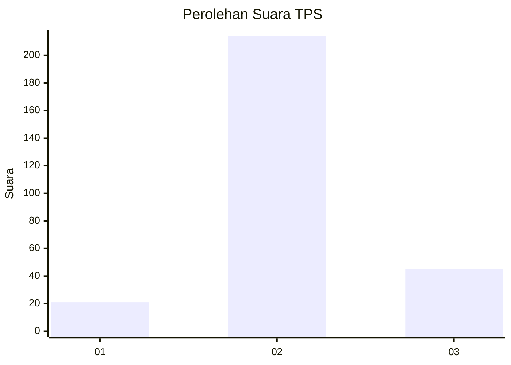
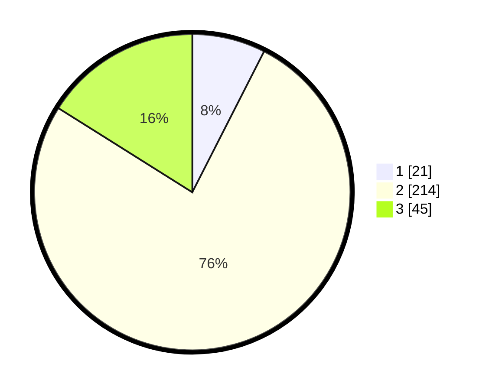

# Hasil

## Grafik

## Tabel

| No. | Nama Paslon    | Suara | Suara (raw) | Persentase |
|:--- |:-------------- | -----:| -----------:| ----------:|
| 1   | ANIES MUHAIMIN | 21    | [21][p-1]   | 7,50       |
| 2   | PRABOWO GIBRAN | 214   | [214][p-2]  | 76,43      |
| 3   | GANJAR MAHFUD  | 45    | [45][p-3]   | 16,07      |

[p-1]: https://github.com/gigit-pemilu/pemilu-2024/blob/main/pilpres/hitung-suara/sub/35-jawa-timur/sub/79-kota-batu/sub/02-bumiaji/sub/2003-tulungrejo/sub/022-tps/sub/paslon-1.txt
[p-2]: https://github.com/gigit-pemilu/pemilu-2024/blob/main/pilpres/hitung-suara/sub/35-jawa-timur/sub/79-kota-batu/sub/02-bumiaji/sub/2003-tulungrejo/sub/022-tps/sub/paslon-2.txt
[p-3]: https://github.com/gigit-pemilu/pemilu-2024/blob/main/pilpres/hitung-suara/sub/35-jawa-timur/sub/79-kota-batu/sub/02-bumiaji/sub/2003-tulungrejo/sub/022-tps/sub/paslon-3.txt

## Foto C Plano

https://sirekap-obj-formc.kpu.go.id/20c8/pemilu/ppwp/35/79/02/20/03/3579022003022-20240218-154838--a3f2a4dd-6a57-4a61-92fd-c6873954203e.jpg

https://sirekap-obj-formc.kpu.go.id/20c8/pemilu/ppwp/35/79/02/20/03/3579022003022-20240218-154844--8b7381d6-6abd-4ec6-abb6-1c2fc754a1d7.jpg

https://sirekap-obj-formc.kpu.go.id/20c8/pemilu/ppwp/35/79/02/20/03/3579022003022-20240218-154849--a7bb0e45-b5c5-4b12-9583-4c4dddaa1f31.jpg

## Metadata

| Key        | Value               |
| ---------- | ------------------- |
| Time Stamp | 2024-02-19 06:16:00 |

