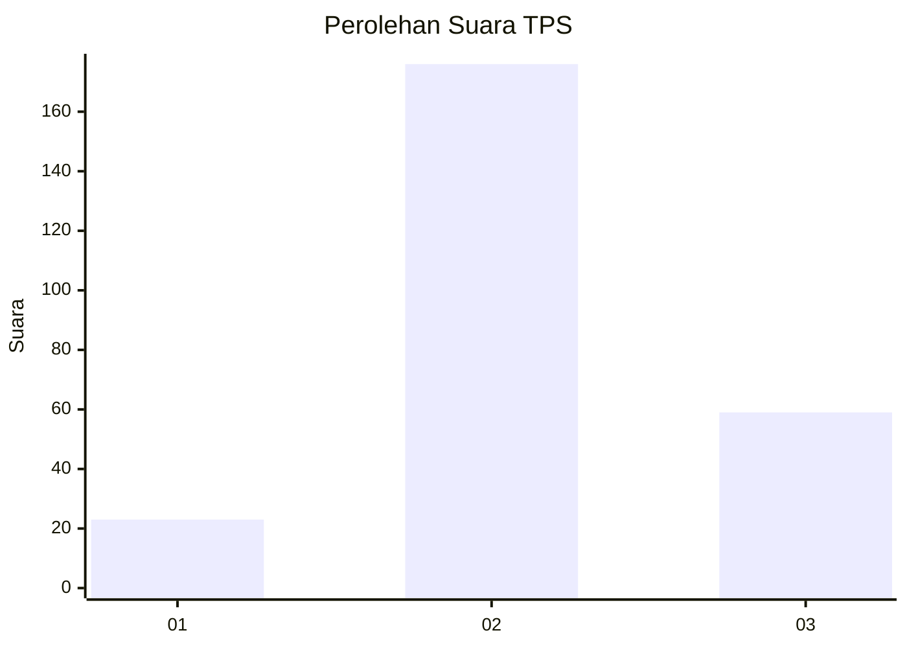
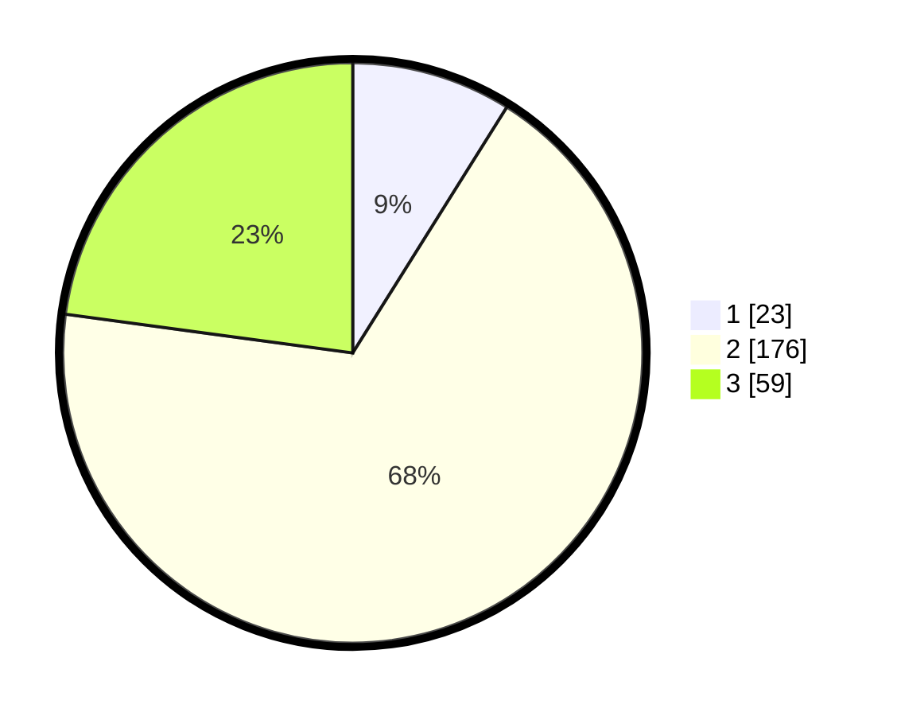

# Hasil

## Grafik

## Tabel

| No. | Nama Paslon    | Suara | Suara (raw) | Persentase |
|:--- |:-------------- | -----:| -----------:| ----------:|
| 1   | ANIES MUHAIMIN | 23    | [23][p-1]   | 8,91       |
| 2   | PRABOWO GIBRAN | 176   | [176][p-2]  | 68,22      |
| 3   | GANJAR MAHFUD  | 59    | [59][p-3]   | 22,87      |

[p-1]: https://github.com/gigit-pemilu/pemilu-2024-35-jawa-timur/blob/main/pilpres/hitung-suara/sub/35-jawa-timur/sub/79-kota-batu/sub/02-bumiaji/sub/2007-giripurno/sub/014-tps/sub/paslon-1.txt
[p-2]: https://github.com/gigit-pemilu/pemilu-2024-35-jawa-timur/blob/main/pilpres/hitung-suara/sub/35-jawa-timur/sub/79-kota-batu/sub/02-bumiaji/sub/2007-giripurno/sub/014-tps/sub/paslon-2.txt
[p-3]: https://github.com/gigit-pemilu/pemilu-2024-35-jawa-timur/blob/main/pilpres/hitung-suara/sub/35-jawa-timur/sub/79-kota-batu/sub/02-bumiaji/sub/2007-giripurno/sub/014-tps/sub/paslon-3.txt

## Foto C Plano

https://sirekap-obj-formc.kpu.go.id/75fa/pemilu/ppwp/35/79/02/20/07/3579022007014-20240218-174313--28871de2-aafe-4449-8065-1585996d4e99.jpg

https://sirekap-obj-formc.kpu.go.id/75fa/pemilu/ppwp/35/79/02/20/07/3579022007014-20240218-174551--5e61b35a-471a-4d0a-8bda-491d888aa64a.jpg

https://sirekap-obj-formc.kpu.go.id/75fa/pemilu/ppwp/35/79/02/20/07/3579022007014-20240218-174551--aee852ca-eb20-4254-b938-85bfca05e122.jpg

## Metadata

| Key        | Value               |
| ---------- | ------------------- |
| Time Stamp | 2024-02-19 06:16:00 |

