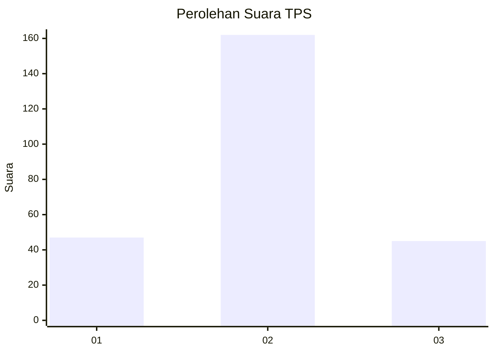
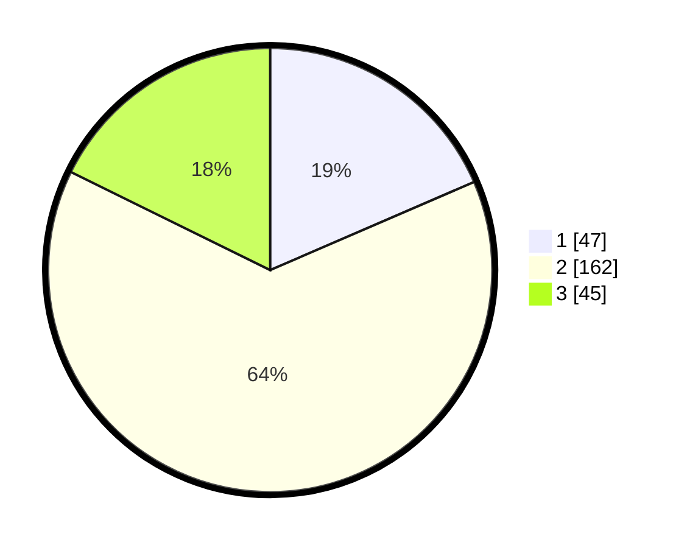

# Hasil

## Grafik

## Tabel

| No. | Nama Paslon    | Suara | Suara (raw) | Persentase |
|:--- |:-------------- | -----:| -----------:| ----------:|
| 1   | ANIES MUHAIMIN | 47    | [47][p-1]   | 18,50      |
| 2   | PRABOWO GIBRAN | 162   | [162][p-2]  | 63,78      |
| 3   | GANJAR MAHFUD  | 45    | [45][p-3]   | 17,72      |

[p-1]: https://github.com/gigit-pemilu/pemilu-2024-35-jawa-timur/blob/main/pilpres/hitung-suara/sub/35-jawa-timur/sub/79-kota-batu/sub/03-junrejo/sub/1001-dadaprejo/sub/003-tps/sub/paslon-1.txt
[p-2]: https://github.com/gigit-pemilu/pemilu-2024-35-jawa-timur/blob/main/pilpres/hitung-suara/sub/35-jawa-timur/sub/79-kota-batu/sub/03-junrejo/sub/1001-dadaprejo/sub/003-tps/sub/paslon-2.txt
[p-3]: https://github.com/gigit-pemilu/pemilu-2024-35-jawa-timur/blob/main/pilpres/hitung-suara/sub/35-jawa-timur/sub/79-kota-batu/sub/03-junrejo/sub/1001-dadaprejo/sub/003-tps/sub/paslon-3.txt

## Foto C Plano

https://sirekap-obj-formc.kpu.go.id/65ab/pemilu/ppwp/35/79/03/10/01/3579031001003-20240216-100509--7dc796de-2ede-4aaf-9066-8273bbbf39ad.jpg

https://sirekap-obj-formc.kpu.go.id/65ab/pemilu/ppwp/35/79/03/10/01/3579031001003-20240216-100601--bcc53470-adde-4e64-bec8-a6037d4d80db.jpg

https://sirekap-obj-formc.kpu.go.id/65ab/pemilu/ppwp/35/79/03/10/01/3579031001003-20240216-100735--594f34fd-e66c-478a-8d68-04fba9f84f5e.jpg

## Metadata

| Key        | Value               |
| ---------- | ------------------- |
| Time Stamp | 2024-02-17 18:30:00 |

