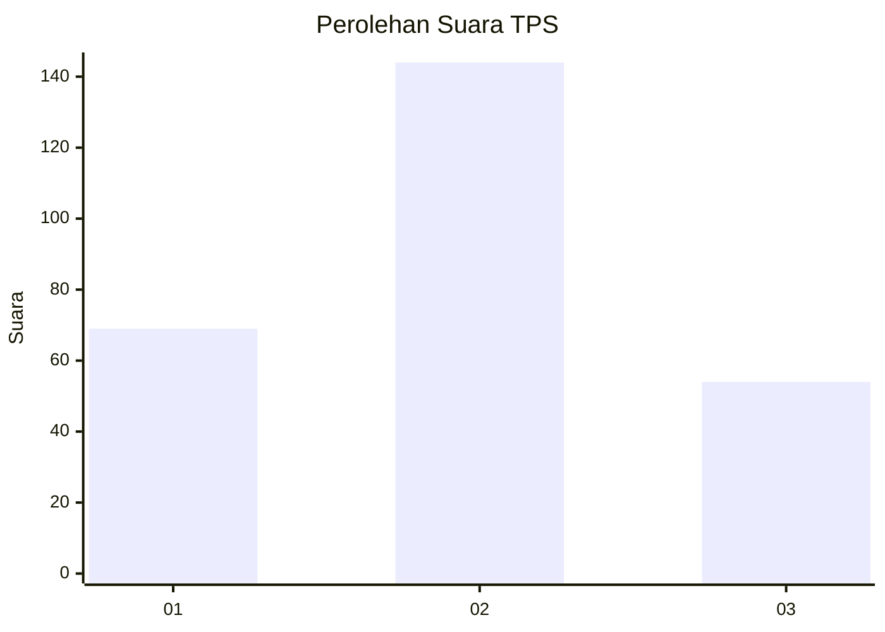
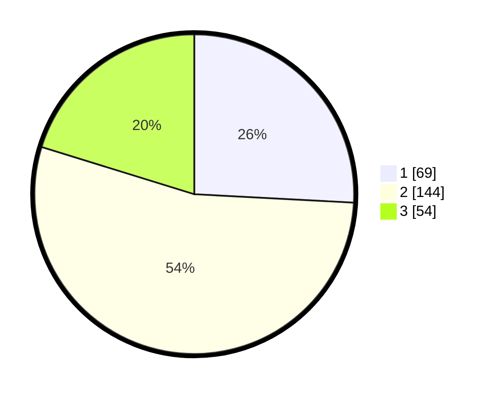

# Hasil

## Grafik

## Tabel

| No. | Nama Paslon    | Suara | Suara (raw) | Persentase |
|:--- |:-------------- | -----:| -----------:| ----------:|
| 1   | ANIES MUHAIMIN | 69    | [69][p-1]   | 25,84      |
| 2   | PRABOWO GIBRAN | 144   | [144][p-2]  | 53,93      |
| 3   | GANJAR MAHFUD  | 54    | [54][p-3]   | 20,22      |

[p-1]: https://github.com/gigit-pemilu/pemilu-2024/blob/main/pilpres/hitung-suara/sub/35-jawa-timur/sub/79-kota-batu/sub/03-junrejo/sub/1001-dadaprejo/sub/004-tps/sub/paslon-1.txt
[p-2]: https://github.com/gigit-pemilu/pemilu-2024/blob/main/pilpres/hitung-suara/sub/35-jawa-timur/sub/79-kota-batu/sub/03-junrejo/sub/1001-dadaprejo/sub/004-tps/sub/paslon-2.txt
[p-3]: https://github.com/gigit-pemilu/pemilu-2024/blob/main/pilpres/hitung-suara/sub/35-jawa-timur/sub/79-kota-batu/sub/03-junrejo/sub/1001-dadaprejo/sub/004-tps/sub/paslon-3.txt

## Foto C Plano

https://sirekap-obj-formc.kpu.go.id/ebbf/pemilu/ppwp/35/79/03/10/01/3579031001004-20240219-104721--7209de86-a179-4a47-b976-ae3e98facbee.jpg

https://sirekap-obj-formc.kpu.go.id/ebbf/pemilu/ppwp/35/79/03/10/01/3579031001004-20240219-104835--d5583e34-2181-4685-b79a-7d5fa2317127.jpg

https://sirekap-obj-formc.kpu.go.id/ebbf/pemilu/ppwp/35/79/03/10/01/3579031001004-20240219-104806--e33e597a-a8eb-4b49-9a94-8adb98ca0ae1.jpg

## Metadata

| Key        | Value               |
| ---------- | ------------------- |
| Time Stamp | 2024-02-19 20:00:00 |

