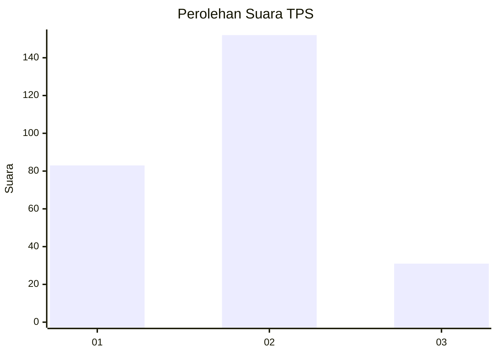
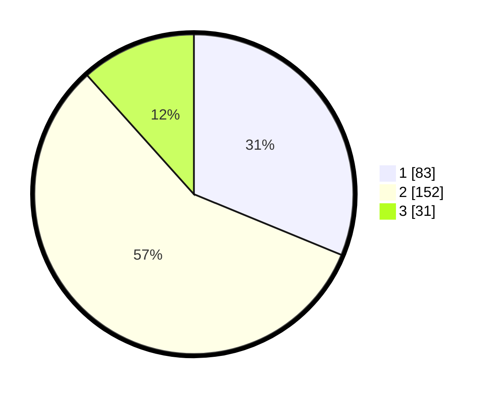

# Hasil

## Grafik

## Tabel

| No. | Nama Paslon    | Suara | Suara (raw) | Persentase |
|:--- |:-------------- | -----:| -----------:| ----------:|
| 1   | ANIES MUHAIMIN | 83    | [83][p-1]   | 31,20      |
| 2   | PRABOWO GIBRAN | 152   | [152][p-2]  | 57,14      |
| 3   | GANJAR MAHFUD  | 31    | [31][p-3]   | 11,65      |

[p-1]: https://github.com/gigit-pemilu/pemilu-2024-35-jawa-timur/blob/main/pilpres/hitung-suara/sub/35-jawa-timur/sub/79-kota-batu/sub/03-junrejo/sub/1001-dadaprejo/sub/005-tps/sub/paslon-1.txt
[p-2]: https://github.com/gigit-pemilu/pemilu-2024-35-jawa-timur/blob/main/pilpres/hitung-suara/sub/35-jawa-timur/sub/79-kota-batu/sub/03-junrejo/sub/1001-dadaprejo/sub/005-tps/sub/paslon-2.txt
[p-3]: https://github.com/gigit-pemilu/pemilu-2024-35-jawa-timur/blob/main/pilpres/hitung-suara/sub/35-jawa-timur/sub/79-kota-batu/sub/03-junrejo/sub/1001-dadaprejo/sub/005-tps/sub/paslon-3.txt

## Foto C Plano

https://sirekap-obj-formc.kpu.go.id/8efc/pemilu/ppwp/35/79/03/10/01/3579031001005-20240219-104459--1e157704-d040-4f1a-b9d7-14e8e269c34c.jpg

https://sirekap-obj-formc.kpu.go.id/8efc/pemilu/ppwp/35/79/03/10/01/3579031001005-20240219-104526--86d83271-69a5-4a6a-8eb9-f94583d940ca.jpg

https://sirekap-obj-formc.kpu.go.id/8efc/pemilu/ppwp/35/79/03/10/01/3579031001005-20240219-104555--35b26db9-b099-4ac2-8f4f-ff2c2a564619.jpg

## Metadata

| Key        | Value               |
| ---------- | ------------------- |
| Time Stamp | 2024-02-19 20:00:00 |

