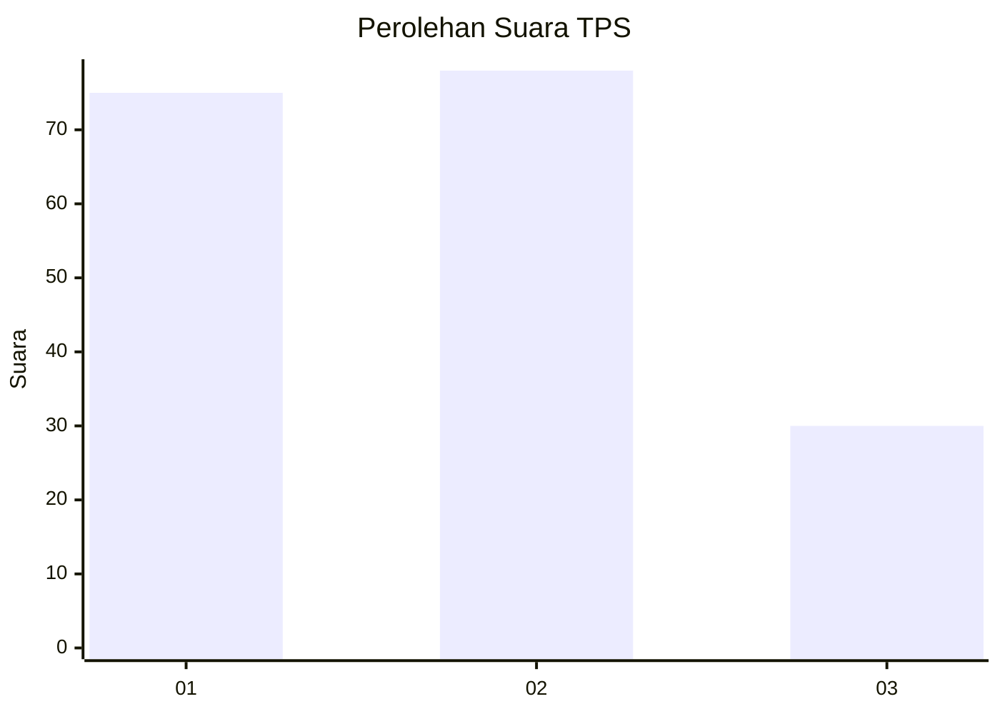
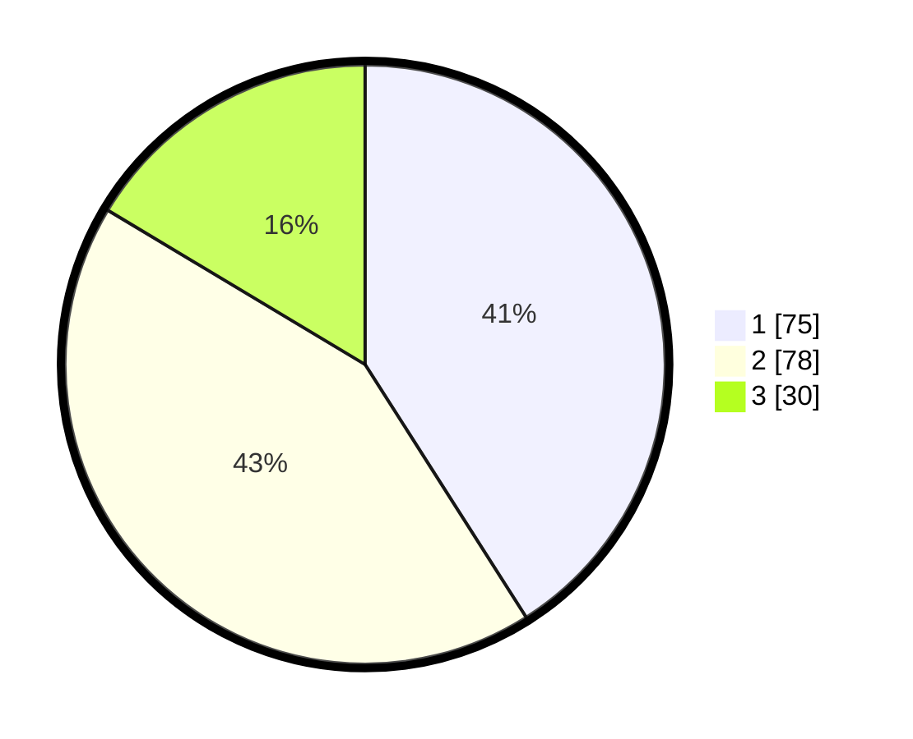

# Hasil

## Grafik

## Tabel

| No. | Nama Paslon    | Suara | Suara (raw) | Persentase |
|:--- |:-------------- | -----:| -----------:| ----------:|
| 1   | ANIES MUHAIMIN | 75    | [75][p-1]   | 40,98      |
| 2   | PRABOWO GIBRAN | 78    | [78][p-2]   | 42,62      |
| 3   | GANJAR MAHFUD  | 30    | [30][p-3]   | 16,39      |

[p-1]: https://github.com/gigit-pemilu/pemilu-2024-35-jawa-timur/blob/main/pilpres/hitung-suara/sub/35-jawa-timur/sub/79-kota-batu/sub/03-junrejo/sub/1001-dadaprejo/sub/012-tps/sub/paslon-1.txt
[p-2]: https://github.com/gigit-pemilu/pemilu-2024-35-jawa-timur/blob/main/pilpres/hitung-suara/sub/35-jawa-timur/sub/79-kota-batu/sub/03-junrejo/sub/1001-dadaprejo/sub/012-tps/sub/paslon-2.txt
[p-3]: https://github.com/gigit-pemilu/pemilu-2024-35-jawa-timur/blob/main/pilpres/hitung-suara/sub/35-jawa-timur/sub/79-kota-batu/sub/03-junrejo/sub/1001-dadaprejo/sub/012-tps/sub/paslon-3.txt

## Foto C Plano

https://sirekap-obj-formc.kpu.go.id/285e/pemilu/ppwp/35/79/03/10/01/3579031001012-20240214-205104--e5330440-2225-4386-9000-f08299018f5b.jpg

https://sirekap-obj-formc.kpu.go.id/285e/pemilu/ppwp/35/79/03/10/01/3579031001012-20240214-205224--007f4d39-71f4-4b97-8ee4-227b9bac7f7f.jpg

https://sirekap-obj-formc.kpu.go.id/285e/pemilu/ppwp/35/79/03/10/01/3579031001012-20240214-222602--ab761ef5-4df3-4d3e-ba69-39be75b0924e.jpg

## Metadata

| Key        | Value               |
| ---------- | ------------------- |
| Time Stamp | 2024-02-15 02:10:27 |

