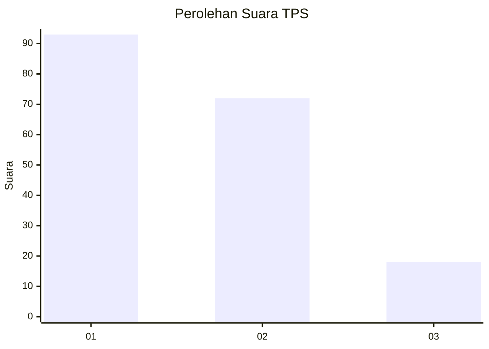
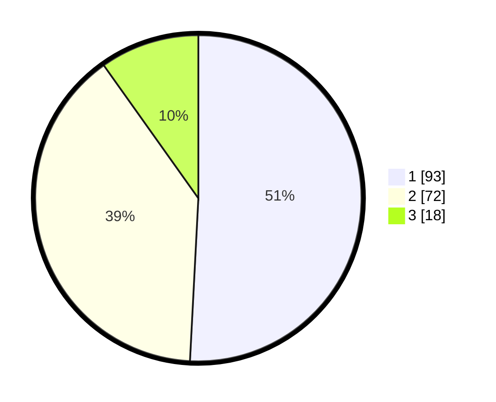

# Hasil

## Grafik

## Tabel

| No. | Nama Paslon    | Suara | Suara (raw) | Persentase |
|:--- |:-------------- | -----:| -----------:| ----------:|
| 1   | ANIES MUHAIMIN | 93    | [93][p-1]   | 50,82      |
| 2   | PRABOWO GIBRAN | 72    | [72][p-2]   | 39,34      |
| 3   | GANJAR MAHFUD  | 18    | [18][p-3]   | 9,84       |

[p-1]: https://github.com/gigit-pemilu/pemilu-2024-35-jawa-timur/blob/main/pilpres/hitung-suara/sub/35-jawa-timur/sub/79-kota-batu/sub/03-junrejo/sub/1001-dadaprejo/sub/013-tps/sub/paslon-1.txt
[p-2]: https://github.com/gigit-pemilu/pemilu-2024-35-jawa-timur/blob/main/pilpres/hitung-suara/sub/35-jawa-timur/sub/79-kota-batu/sub/03-junrejo/sub/1001-dadaprejo/sub/013-tps/sub/paslon-2.txt
[p-3]: https://github.com/gigit-pemilu/pemilu-2024-35-jawa-timur/blob/main/pilpres/hitung-suara/sub/35-jawa-timur/sub/79-kota-batu/sub/03-junrejo/sub/1001-dadaprejo/sub/013-tps/sub/paslon-3.txt

## Foto C Plano

https://sirekap-obj-formc.kpu.go.id/8401/pemilu/ppwp/35/79/03/10/01/3579031001013-20240219-112855--f0fd0569-6917-4972-a217-adac2c5bb6f8.jpg

https://sirekap-obj-formc.kpu.go.id/8401/pemilu/ppwp/35/79/03/10/01/3579031001013-20240219-113238--c63b7c17-d18c-4b72-ba81-e97f62dc8ed7.jpg

https://sirekap-obj-formc.kpu.go.id/8401/pemilu/ppwp/35/79/03/10/01/3579031001013-20240219-113108--bb3c08e5-71eb-49aa-82f7-64ddcb05a7c6.jpg

## Metadata

| Key        | Value               |
| ---------- | ------------------- |
| Time Stamp | 2024-02-19 20:00:00 |

