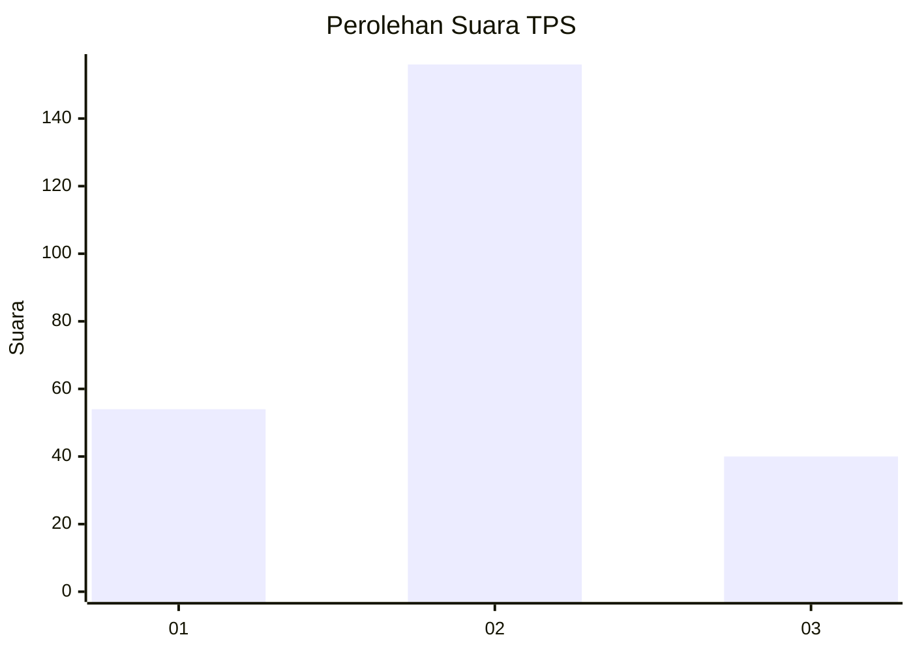

# Hasil

## Grafik

## Tabel

| No. | Nama Paslon    | Suara | Suara (raw) | Persentase |
|:--- |:-------------- | -----:| -----------:| ----------:|
| 1   | ANIES MUHAIMIN | 54    | [54][p-1]   | 21,60      |
| 2   | PRABOWO GIBRAN | 156   | [156][p-2]  | 62,40      |
| 3   | GANJAR MAHFUD  | 40    | [40][p-3]   | 16,00      |

[p-1]: https://github.com/gigit-pemilu/pemilu-2024-35-jawa-timur/blob/main/pilpres/hitung-suara/sub/35-jawa-timur/sub/79-kota-batu/sub/03-junrejo/sub/1001-dadaprejo/sub/017-tps/sub/paslon-1.txt
[p-2]: https://github.com/gigit-pemilu/pemilu-2024-35-jawa-timur/blob/main/pilpres/hitung-suara/sub/35-jawa-timur/sub/79-kota-batu/sub/03-junrejo/sub/1001-dadaprejo/sub/017-tps/sub/paslon-2.txt
[p-3]: https://github.com/gigit-pemilu/pemilu-2024-35-jawa-timur/blob/main/pilpres/hitung-suara/sub/35-jawa-timur/sub/79-kota-batu/sub/03-junrejo/sub/1001-dadaprejo/sub/017-tps/sub/paslon-3.txt

## Foto C Plano

https://sirekap-obj-formc.kpu.go.id/8d17/pemilu/ppwp/35/79/03/10/01/3579031001017-20240219-105327--27db1433-63ab-4451-ba81-38eebfaa5e4c.jpg

https://sirekap-obj-formc.kpu.go.id/8d17/pemilu/ppwp/35/79/03/10/01/3579031001017-20240219-105417--53098925-ad3b-46f4-8a7f-e216327fdc88.jpg

https://sirekap-obj-formc.kpu.go.id/8d17/pemilu/ppwp/35/79/03/10/01/3579031001017-20240219-105452--7777ebe8-ec22-43c8-895d-bf81e26fd72b.jpg

## Metadata

| Key        | Value               |
| ---------- | ------------------- |
| Time Stamp | 2024-02-19 20:00:00 |

