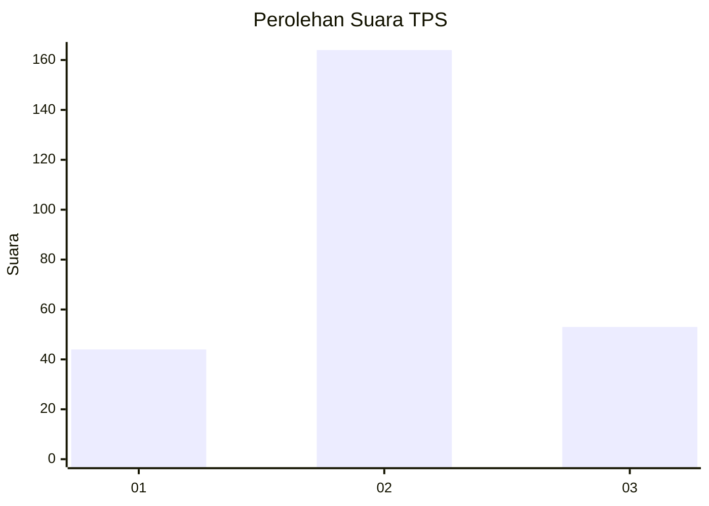
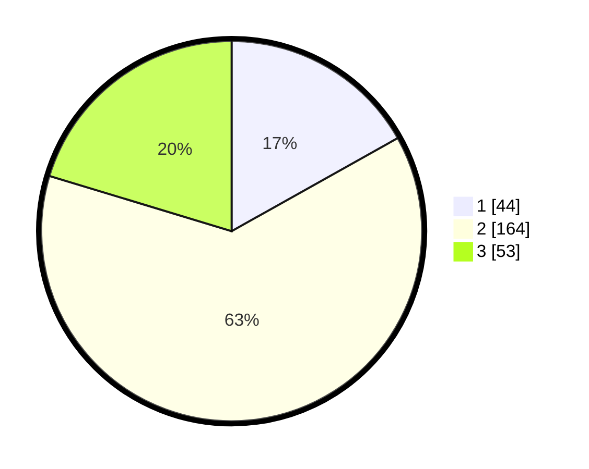

# Hasil

## Grafik

## Tabel

| No. | Nama Paslon    | Suara | Suara (raw) | Persentase |
|:--- |:-------------- | -----:| -----------:| ----------:|
| 1   | ANIES MUHAIMIN | 44    | [44][p-1]   | 16,86      |
| 2   | PRABOWO GIBRAN | 164   | [164][p-2]  | 62,84      |
| 3   | GANJAR MAHFUD  | 53    | [53][p-3]   | 20,31      |

[p-1]: https://github.com/gigit-pemilu/pemilu-2024-35-jawa-timur/blob/main/pilpres/hitung-suara/sub/35-jawa-timur/sub/79-kota-batu/sub/03-junrejo/sub/2002-beji/sub/011-tps/sub/paslon-1.txt
[p-2]: https://github.com/gigit-pemilu/pemilu-2024-35-jawa-timur/blob/main/pilpres/hitung-suara/sub/35-jawa-timur/sub/79-kota-batu/sub/03-junrejo/sub/2002-beji/sub/011-tps/sub/paslon-2.txt
[p-3]: https://github.com/gigit-pemilu/pemilu-2024-35-jawa-timur/blob/main/pilpres/hitung-suara/sub/35-jawa-timur/sub/79-kota-batu/sub/03-junrejo/sub/2002-beji/sub/011-tps/sub/paslon-3.txt

## Foto C Plano

https://sirekap-obj-formc.kpu.go.id/b026/pemilu/ppwp/35/79/03/20/02/3579032002011-20240219-190410--032428d3-e6e8-4227-8e23-d509213dedc2.jpg

https://sirekap-obj-formc.kpu.go.id/b026/pemilu/ppwp/35/79/03/20/02/3579032002011-20240219-190432--80d9b1a9-5587-4c5c-b6cb-fc5c843d5201.jpg

https://sirekap-obj-formc.kpu.go.id/b026/pemilu/ppwp/35/79/03/20/02/3579032002011-20240219-190457--ef5ff9b7-4b70-4d03-bc3f-8a0df99b97d8.jpg

## Metadata

| Key        | Value               |
| ---------- | ------------------- |
| Time Stamp | 2024-02-19 20:00:00 |

