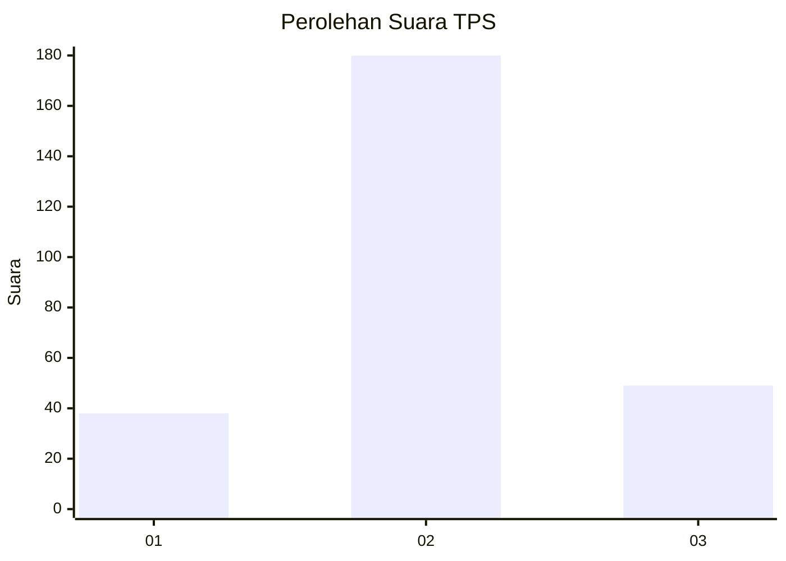
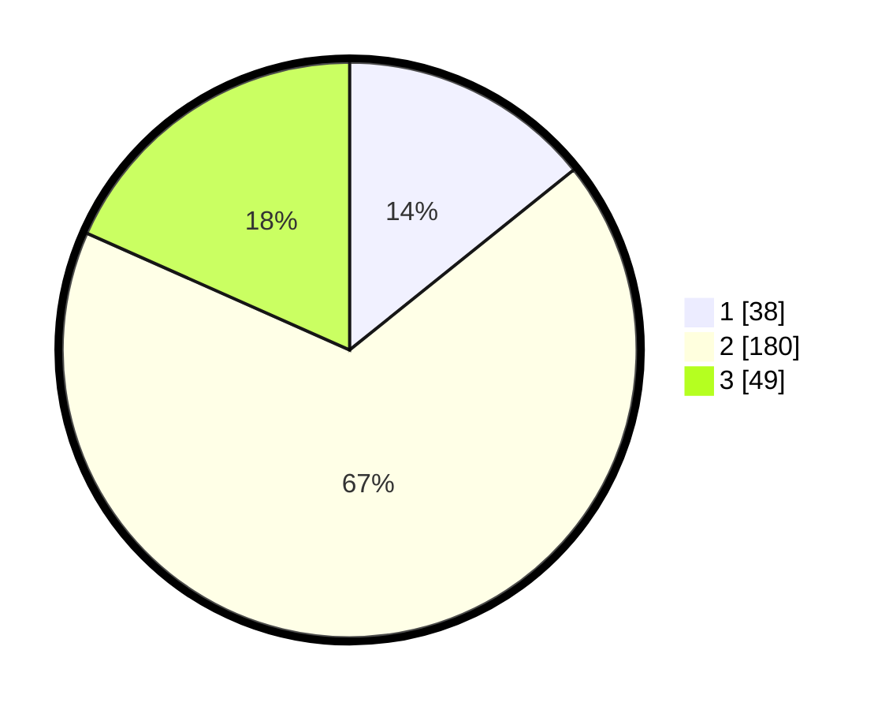

# Hasil

## Grafik

## Tabel

| No. | Nama Paslon    | Suara | Suara (raw) | Persentase |
|:--- |:-------------- | -----:| -----------:| ----------:|
| 1   | ANIES MUHAIMIN | 38    | [38][p-1]   | 14,23      |
| 2   | PRABOWO GIBRAN | 180   | [180][p-2]  | 67,42      |
| 3   | GANJAR MAHFUD  | 49    | [49][p-3]   | 18,35      |

[p-1]: https://github.com/gigit-pemilu/pemilu-2024/blob/main/pilpres/hitung-suara/sub/35-jawa-timur/sub/79-kota-batu/sub/03-junrejo/sub/2002-beji/sub/012-tps/sub/paslon-1.txt
[p-2]: https://github.com/gigit-pemilu/pemilu-2024/blob/main/pilpres/hitung-suara/sub/35-jawa-timur/sub/79-kota-batu/sub/03-junrejo/sub/2002-beji/sub/012-tps/sub/paslon-2.txt
[p-3]: https://github.com/gigit-pemilu/pemilu-2024/blob/main/pilpres/hitung-suara/sub/35-jawa-timur/sub/79-kota-batu/sub/03-junrejo/sub/2002-beji/sub/012-tps/sub/paslon-3.txt

## Foto C Plano

https://sirekap-obj-formc.kpu.go.id/c9f5/pemilu/ppwp/35/79/03/20/02/3579032002012-20240219-182120--69d0090c-d425-4953-aa5c-7864357a3a13.jpg

https://sirekap-obj-formc.kpu.go.id/c9f5/pemilu/ppwp/35/79/03/20/02/3579032002012-20240219-182158--331be656-35bd-41e0-b5b1-932a7c37fc0a.jpg

https://sirekap-obj-formc.kpu.go.id/c9f5/pemilu/ppwp/35/79/03/20/02/3579032002012-20240219-182249--dae0f87d-e8db-41b0-a2ce-f631377a473f.jpg

## Metadata

| Key        | Value               |
| ---------- | ------------------- |
| Time Stamp | 2024-02-19 20:00:00 |

