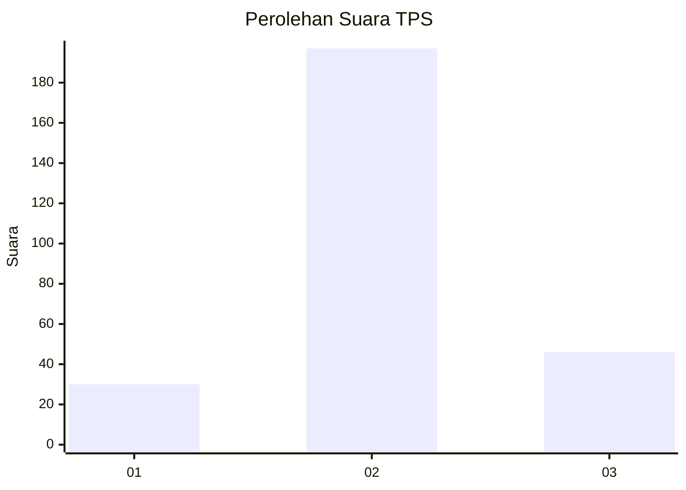
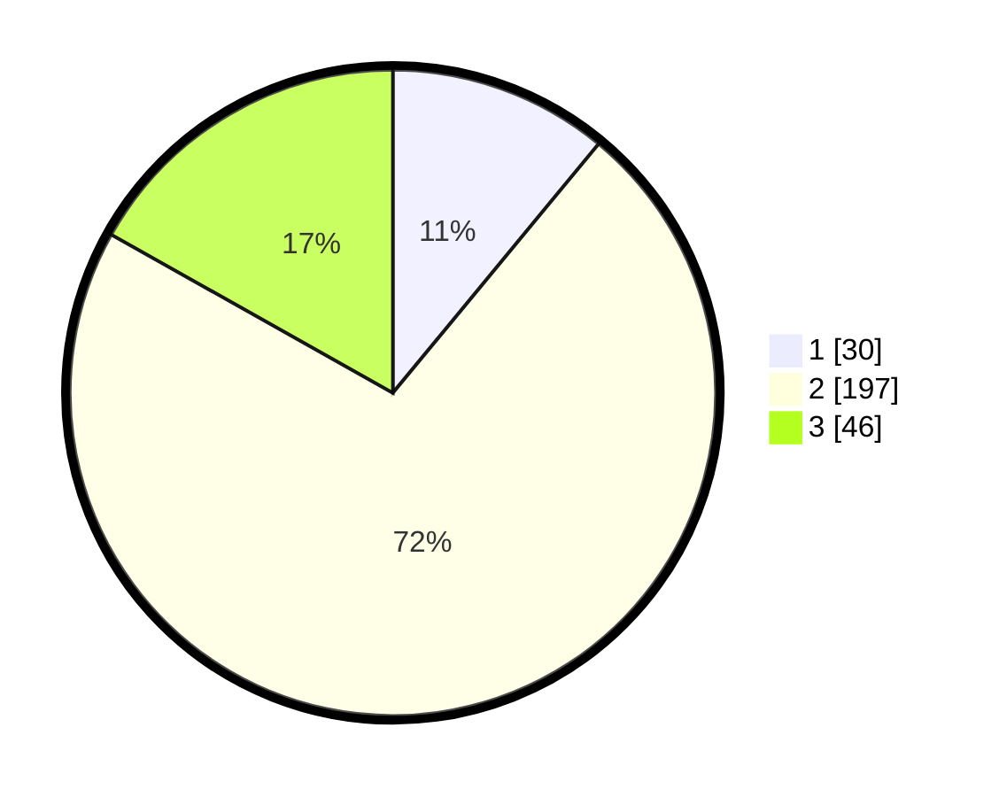

# Hasil

## Grafik

## Tabel

| No. | Nama Paslon    | Suara | Suara (raw) | Persentase |
|:--- |:-------------- | -----:| -----------:| ----------:|
| 1   | ANIES MUHAIMIN | 30    | [30][p-1]   | 10,99      |
| 2   | PRABOWO GIBRAN | 197   | [197][p-2]  | 72,16      |
| 3   | GANJAR MAHFUD  | 46    | [46][p-3]   | 16,85      |

[p-1]: https://github.com/gigit-pemilu/pemilu-2024-35-jawa-timur/blob/main/pilpres/hitung-suara/sub/35-jawa-timur/sub/79-kota-batu/sub/03-junrejo/sub/2002-beji/sub/020-tps/sub/paslon-1.txt
[p-2]: https://github.com/gigit-pemilu/pemilu-2024-35-jawa-timur/blob/main/pilpres/hitung-suara/sub/35-jawa-timur/sub/79-kota-batu/sub/03-junrejo/sub/2002-beji/sub/020-tps/sub/paslon-2.txt
[p-3]: https://github.com/gigit-pemilu/pemilu-2024-35-jawa-timur/blob/main/pilpres/hitung-suara/sub/35-jawa-timur/sub/79-kota-batu/sub/03-junrejo/sub/2002-beji/sub/020-tps/sub/paslon-3.txt

## Foto C Plano

https://sirekap-obj-formc.kpu.go.id/d5e3/pemilu/ppwp/35/79/03/20/02/3579032002020-20240219-185945--a3fedc58-f4d0-407b-ac20-6d8ec71bf3c4.jpg

https://sirekap-obj-formc.kpu.go.id/d5e3/pemilu/ppwp/35/79/03/20/02/3579032002020-20240219-190018--fe95a3a9-490f-4a01-b497-ebc9ba594b5b.jpg

https://sirekap-obj-formc.kpu.go.id/d5e3/pemilu/ppwp/35/79/03/20/02/3579032002020-20240219-190105--0e86ac37-1500-404a-972f-9f4a2950e0ad.jpg

## Metadata

| Key        | Value               |
| ---------- | ------------------- |
| Time Stamp | 2024-02-19 20:00:00 |

