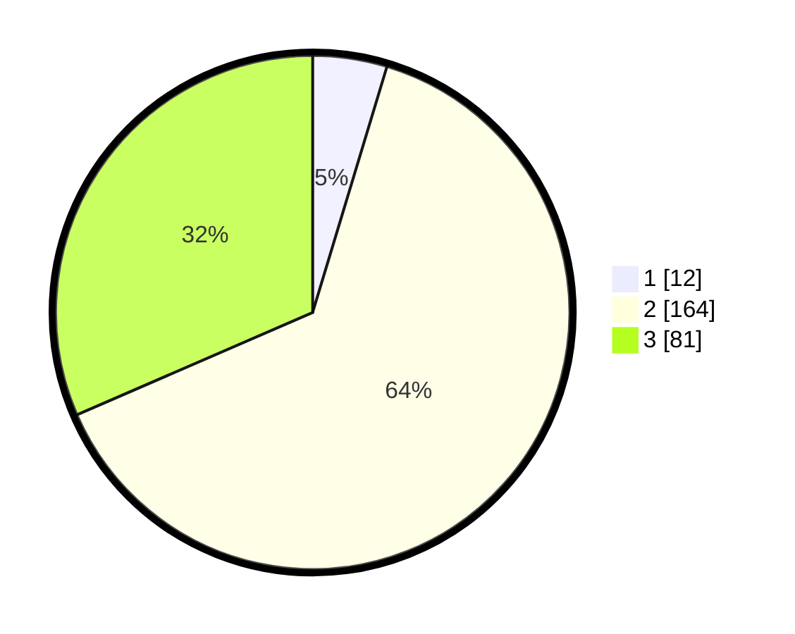

# Hasil

## Grafik

## Tabel

| No. | Nama Paslon    | Suara | Suara (raw) | Persentase |
|:--- |:-------------- | -----:| -----------:| ----------:|
| 1   | ANIES MUHAIMIN | 12    | [12][p-1]   | 4,67       |
| 2   | PRABOWO GIBRAN | 164   | [164][p-2]  | 63,81      |
| 3   | GANJAR MAHFUD  | 81    | [81][p-3]   | 31,52      |

[p-1]: https://github.com/gigit-pemilu/pemilu-2024/blob/main/pilpres/hitung-suara/sub/35-jawa-timur/sub/79-kota-batu/sub/03-junrejo/sub/2003-junrejo/sub/017-tps/sub/paslon-1.txt
[p-2]: https://github.com/gigit-pemilu/pemilu-2024/blob/main/pilpres/hitung-suara/sub/35-jawa-timur/sub/79-kota-batu/sub/03-junrejo/sub/2003-junrejo/sub/017-tps/sub/paslon-2.txt
[p-3]: https://github.com/gigit-pemilu/pemilu-2024/blob/main/pilpres/hitung-suara/sub/35-jawa-timur/sub/79-kota-batu/sub/03-junrejo/sub/2003-junrejo/sub/017-tps/sub/paslon-3.txt

## Foto C Plano

https://sirekap-obj-formc.kpu.go.id/71a8/pemilu/ppwp/35/79/03/20/03/3579032003017-20240218-215004--648762e3-39a1-40f9-82af-1a0accd00ce9.jpg

https://sirekap-obj-formc.kpu.go.id/71a8/pemilu/ppwp/35/79/03/20/03/3579032003017-20240218-215053--e8d1a73f-adfa-4a72-8637-ad1d4952fea6.jpg

https://sirekap-obj-formc.kpu.go.id/71a8/pemilu/ppwp/35/79/03/20/03/3579032003017-20240218-215116--cac96c82-2b6b-47a6-95b9-927953ab97f9.jpg

## Metadata

| Key        | Value               |
| ---------- | ------------------- |
| Time Stamp | 2024-02-19 06:16:00 |

