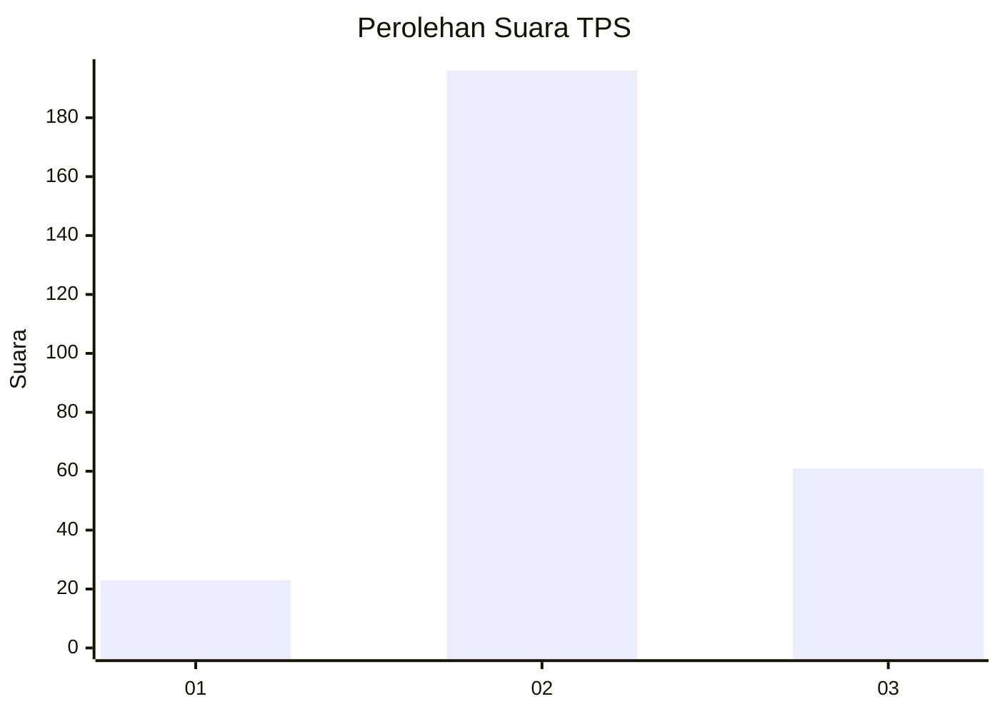
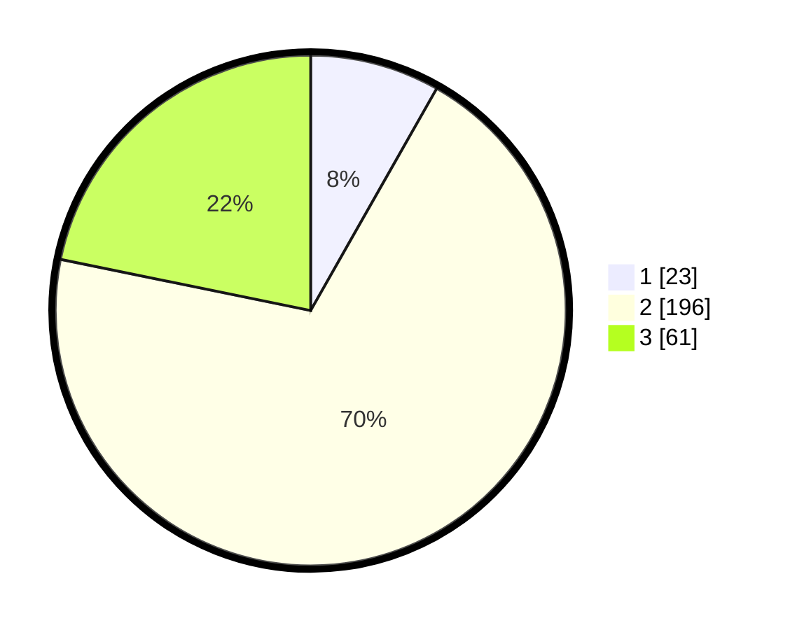

# Hasil

## Grafik

## Tabel

| No. | Nama Paslon    | Suara | Suara (raw) | Persentase |
|:--- |:-------------- | -----:| -----------:| ----------:|
| 1   | ANIES MUHAIMIN | 23    | [23][p-1]   | 8,21       |
| 2   | PRABOWO GIBRAN | 196   | [196][p-2]  | 70,00      |
| 3   | GANJAR MAHFUD  | 61    | [61][p-3]   | 21,79      |

[p-1]: https://github.com/gigit-pemilu/pemilu-2024-35-jawa-timur/blob/main/pilpres/hitung-suara/sub/35-jawa-timur/sub/79-kota-batu/sub/03-junrejo/sub/2003-junrejo/sub/019-tps/sub/paslon-1.txt
[p-2]: https://github.com/gigit-pemilu/pemilu-2024-35-jawa-timur/blob/main/pilpres/hitung-suara/sub/35-jawa-timur/sub/79-kota-batu/sub/03-junrejo/sub/2003-junrejo/sub/019-tps/sub/paslon-2.txt
[p-3]: https://github.com/gigit-pemilu/pemilu-2024-35-jawa-timur/blob/main/pilpres/hitung-suara/sub/35-jawa-timur/sub/79-kota-batu/sub/03-junrejo/sub/2003-junrejo/sub/019-tps/sub/paslon-3.txt

## Foto C Plano

https://sirekap-obj-formc.kpu.go.id/0dfb/pemilu/ppwp/35/79/03/20/03/3579032003019-20240218-201801--bf638b4e-abcd-412f-8e17-a48228b7ff1e.jpg

https://sirekap-obj-formc.kpu.go.id/0dfb/pemilu/ppwp/35/79/03/20/03/3579032003019-20240218-201826--f109a6b9-9346-47b5-be9f-35ec4ad61ab3.jpg

https://sirekap-obj-formc.kpu.go.id/0dfb/pemilu/ppwp/35/79/03/20/03/3579032003019-20240218-201651--ac60a070-5595-40ad-8f6a-9be2edb489e7.jpg

## Metadata

| Key        | Value               |
| ---------- | ------------------- |
| Time Stamp | 2024-02-19 06:16:00 |

