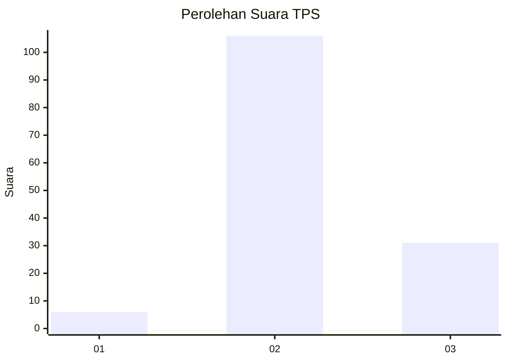

# Hasil

## Grafik

## Tabel

| No. | Nama Paslon    | Suara | Suara (raw) | Persentase |
|:--- |:-------------- | -----:| -----------:| ----------:|
| 1   | ANIES MUHAIMIN | 6     | [6][p-1]    | 4,20       |
| 2   | PRABOWO GIBRAN | 106   | [106][p-2]  | 74,13      |
| 3   | GANJAR MAHFUD  | 31    | [31][p-3]   | 21,68      |

[p-1]: https://github.com/gigit-pemilu/pemilu-2024/blob/main/pilpres/hitung-suara/sub/35-jawa-timur/sub/79-kota-batu/sub/03-junrejo/sub/2004-tlekung/sub/014-tps/sub/paslon-1.txt
[p-2]: https://github.com/gigit-pemilu/pemilu-2024/blob/main/pilpres/hitung-suara/sub/35-jawa-timur/sub/79-kota-batu/sub/03-junrejo/sub/2004-tlekung/sub/014-tps/sub/paslon-2.txt
[p-3]: https://github.com/gigit-pemilu/pemilu-2024/blob/main/pilpres/hitung-suara/sub/35-jawa-timur/sub/79-kota-batu/sub/03-junrejo/sub/2004-tlekung/sub/014-tps/sub/paslon-3.txt

## Foto C Plano

https://sirekap-obj-formc.kpu.go.id/a1a9/pemilu/ppwp/35/79/03/20/04/3579032004014-20240214-141552--1f196209-51bc-4c93-819c-338e6ae45cfa.jpg

https://sirekap-obj-formc.kpu.go.id/a1a9/pemilu/ppwp/35/79/03/20/04/3579032004014-20240214-141750--433ee850-17a1-418d-92fa-3cf90ec201bb.jpg

https://sirekap-obj-formc.kpu.go.id/a1a9/pemilu/ppwp/35/79/03/20/04/3579032004014-20240214-141905--4028870a-055a-46d8-add8-d0ceee0003ac.jpg

## Metadata

| Key        | Value               |
| ---------- | ------------------- |
| Time Stamp | 2024-02-14 21:46:01 |

