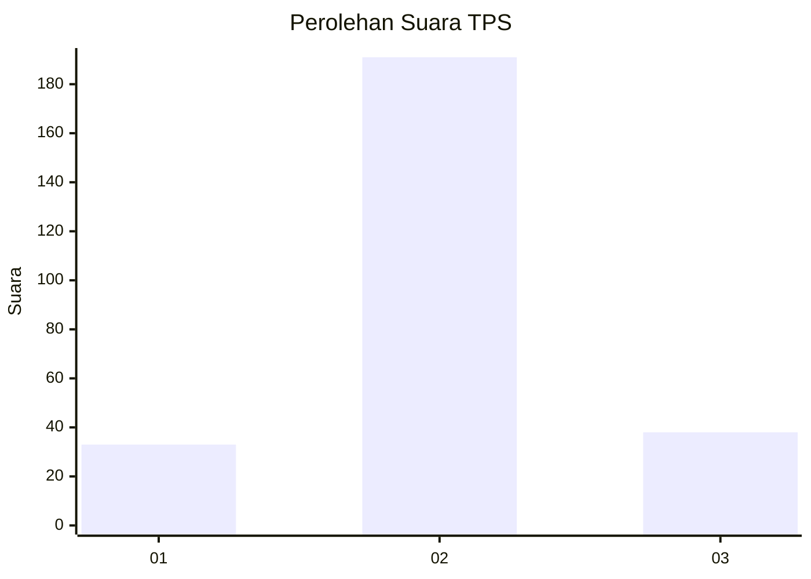
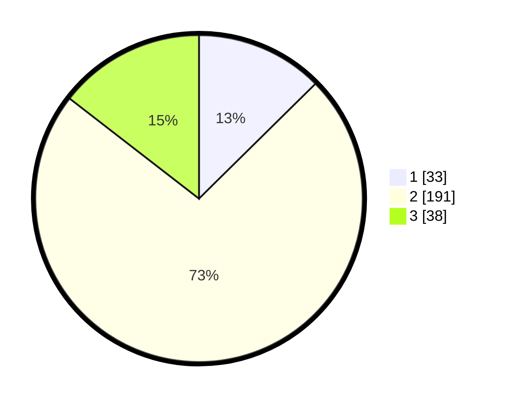

# Hasil

## Grafik

## Tabel

| No. | Nama Paslon    | Suara | Suara (raw) | Persentase |
|:--- |:-------------- | -----:| -----------:| ----------:|
| 1   | ANIES MUHAIMIN | 33    | [33][p-1]   | 12,60      |
| 2   | PRABOWO GIBRAN | 191   | [191][p-2]  | 72,90      |
| 3   | GANJAR MAHFUD  | 38    | [38][p-3]   | 14,50      |

[p-1]: https://github.com/gigit-pemilu/pemilu-2024-35-jawa-timur/blob/main/pilpres/hitung-suara/sub/35-jawa-timur/sub/79-kota-batu/sub/03-junrejo/sub/2006-pendem/sub/017-tps/sub/paslon-1.txt
[p-2]: https://github.com/gigit-pemilu/pemilu-2024-35-jawa-timur/blob/main/pilpres/hitung-suara/sub/35-jawa-timur/sub/79-kota-batu/sub/03-junrejo/sub/2006-pendem/sub/017-tps/sub/paslon-2.txt
[p-3]: https://github.com/gigit-pemilu/pemilu-2024-35-jawa-timur/blob/main/pilpres/hitung-suara/sub/35-jawa-timur/sub/79-kota-batu/sub/03-junrejo/sub/2006-pendem/sub/017-tps/sub/paslon-3.txt

## Foto C Plano

https://sirekap-obj-formc.kpu.go.id/96c1/pemilu/ppwp/35/79/03/20/06/3579032006017-20240219-212351--db331829-21df-4c34-bd78-7d97e5d8cdb8.jpg

https://sirekap-obj-formc.kpu.go.id/96c1/pemilu/ppwp/35/79/03/20/06/3579032006017-20240219-212429--8c5c33b7-45e2-49bb-bb35-54eb0416abb2.jpg

https://sirekap-obj-formc.kpu.go.id/96c1/pemilu/ppwp/35/79/03/20/06/3579032006017-20240219-212506--8c6720d4-04e4-4e4a-a789-8ef903da0f35.jpg

## Metadata

| Key        | Value               |
| ---------- | ------------------- |
| Time Stamp | 2024-02-25 15:00:00 |

