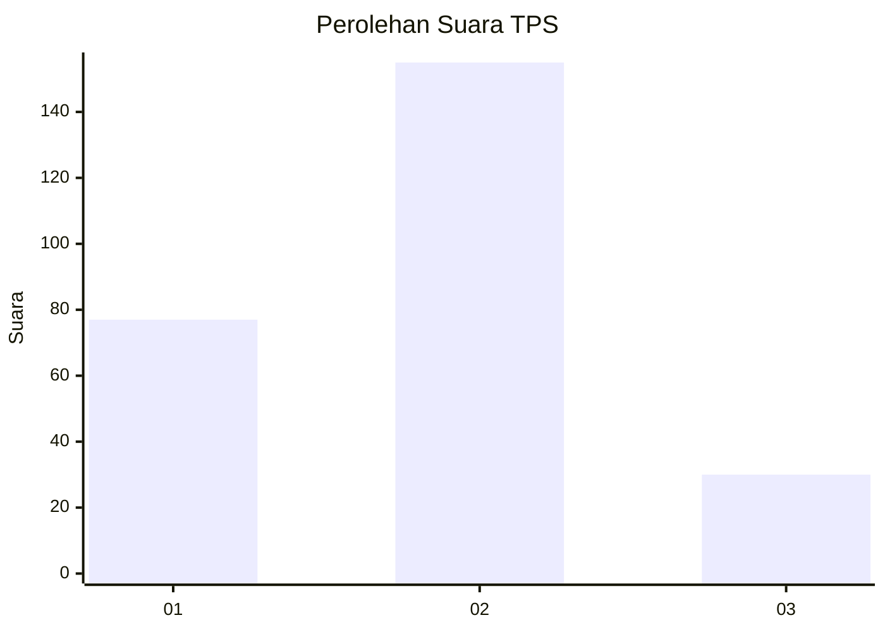
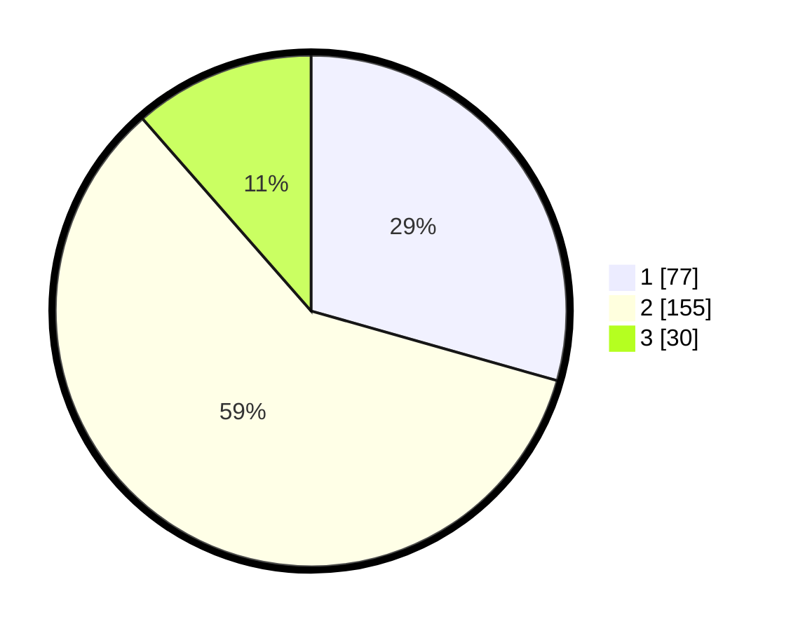

# Hasil

## Grafik

## Tabel

| No. | Nama Paslon    | Suara | Suara (raw) | Persentase |
|:--- |:-------------- | -----:| -----------:| ----------:|
| 1   | ANIES MUHAIMIN | 77    | [77][p-1]   | 29,39      |
| 2   | PRABOWO GIBRAN | 155   | [155][p-2]  | 59,16      |
| 3   | GANJAR MAHFUD  | 30    | [30][p-3]   | 11,45      |

[p-1]: https://github.com/gigit-pemilu/pemilu-2024-35-jawa-timur/blob/main/pilpres/hitung-suara/sub/35-jawa-timur/sub/79-kota-batu/sub/03-junrejo/sub/2006-pendem/sub/021-tps/sub/paslon-1.txt
[p-2]: https://github.com/gigit-pemilu/pemilu-2024-35-jawa-timur/blob/main/pilpres/hitung-suara/sub/35-jawa-timur/sub/79-kota-batu/sub/03-junrejo/sub/2006-pendem/sub/021-tps/sub/paslon-2.txt
[p-3]: https://github.com/gigit-pemilu/pemilu-2024-35-jawa-timur/blob/main/pilpres/hitung-suara/sub/35-jawa-timur/sub/79-kota-batu/sub/03-junrejo/sub/2006-pendem/sub/021-tps/sub/paslon-3.txt

## Foto C Plano

https://sirekap-obj-formc.kpu.go.id/1b54/pemilu/ppwp/35/79/03/20/06/3579032006021-20240218-191337--1aeadeb6-ba4c-41b1-aaf7-dc311eb9c186.jpg

https://sirekap-obj-formc.kpu.go.id/1b54/pemilu/ppwp/35/79/03/20/06/3579032006021-20240218-191356--1f63f705-a8ce-4553-aaf7-d1912c0bf3d2.jpg

https://sirekap-obj-formc.kpu.go.id/1b54/pemilu/ppwp/35/79/03/20/06/3579032006021-20240218-191425--024eacde-430e-4231-a1cd-c56987cd230f.jpg

## Metadata

| Key        | Value               |
| ---------- | ------------------- |
| Time Stamp | 2024-02-24 22:31:28 |

