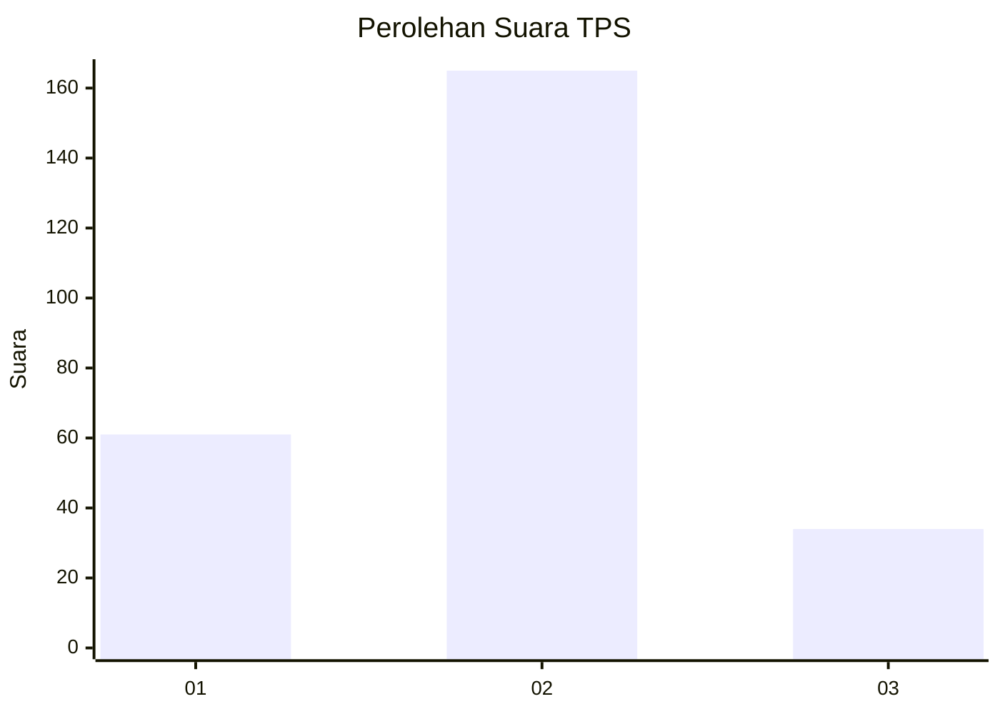
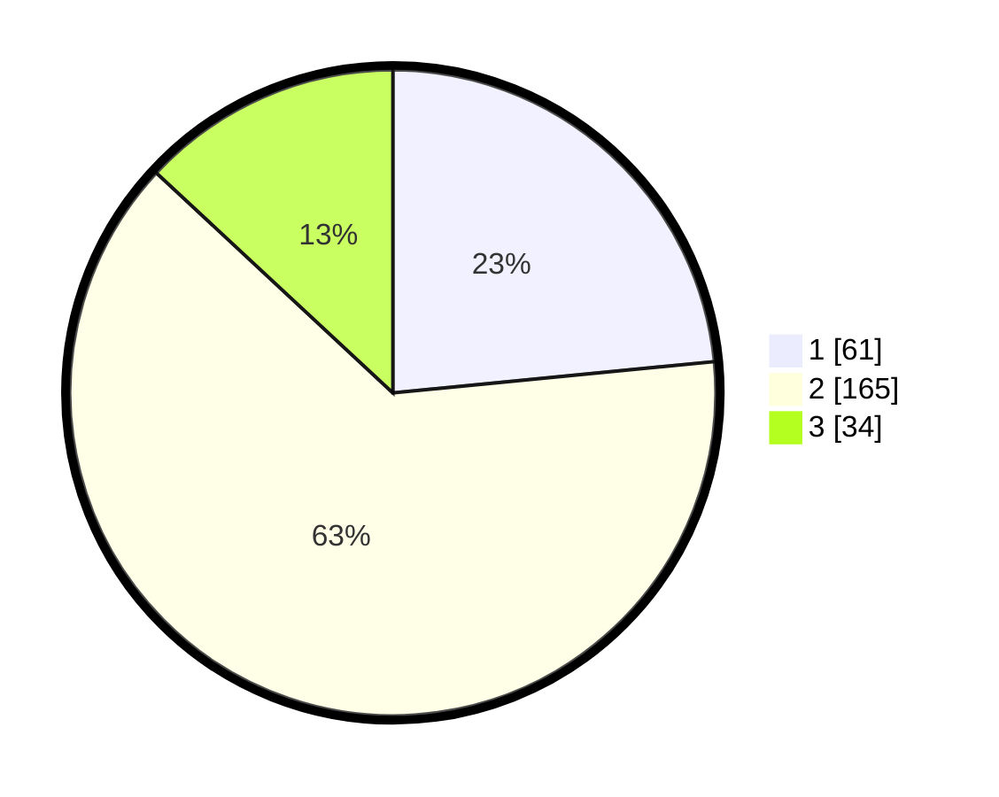

# Hasil

## Grafik

## Tabel

| No. | Nama Paslon    | Suara | Suara (raw) | Persentase |
|:--- |:-------------- | -----:| -----------:| ----------:|
| 1   | ANIES MUHAIMIN | 61    | [61][p-1]   | 23,46      |
| 2   | PRABOWO GIBRAN | 165   | [165][p-2]  | 63,46      |
| 3   | GANJAR MAHFUD  | 34    | [34][p-3]   | 13,08      |

[p-1]: https://github.com/gigit-pemilu/pemilu-2024/blob/main/pilpres/hitung-suara/sub/35-jawa-timur/sub/79-kota-batu/sub/03-junrejo/sub/2006-pendem/sub/024-tps/sub/paslon-1.txt
[p-2]: https://github.com/gigit-pemilu/pemilu-2024/blob/main/pilpres/hitung-suara/sub/35-jawa-timur/sub/79-kota-batu/sub/03-junrejo/sub/2006-pendem/sub/024-tps/sub/paslon-2.txt
[p-3]: https://github.com/gigit-pemilu/pemilu-2024/blob/main/pilpres/hitung-suara/sub/35-jawa-timur/sub/79-kota-batu/sub/03-junrejo/sub/2006-pendem/sub/024-tps/sub/paslon-3.txt

## Foto C Plano

https://sirekap-obj-formc.kpu.go.id/7dc9/pemilu/ppwp/35/79/03/20/06/3579032006024-20240219-162431--f0244cc3-6ec9-4205-9fcb-ead83ff24513.jpg

https://sirekap-obj-formc.kpu.go.id/7dc9/pemilu/ppwp/35/79/03/20/06/3579032006024-20240219-162513--1f3fa761-857e-4943-8751-0629f90ba51d.jpg

https://sirekap-obj-formc.kpu.go.id/7dc9/pemilu/ppwp/35/79/03/20/06/3579032006024-20240219-162550--16179eca-050d-4b3a-bf8e-37e95a8665a7.jpg

## Metadata

| Key        | Value               |
| ---------- | ------------------- |
| Time Stamp | 2024-02-25 16:00:00 |

