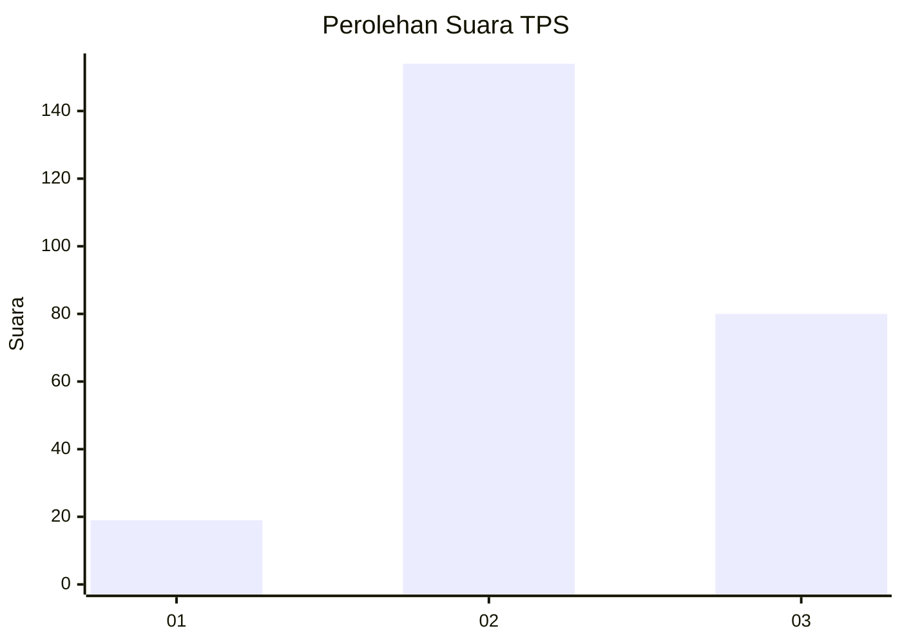
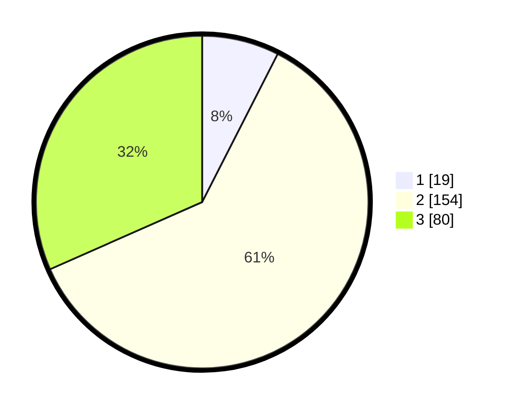

# Hasil

## Grafik

## Tabel

| No. | Nama Paslon    | Suara | Suara (raw) | Persentase |
|:--- |:-------------- | -----:| -----------:| ----------:|
| 1   | ANIES MUHAIMIN | 19    | [19][p-1]   | 7,51       |
| 2   | PRABOWO GIBRAN | 154   | [154][p-2]  | 60,87      |
| 3   | GANJAR MAHFUD  | 80    | [80][p-3]   | 31,62      |

[p-1]: https://github.com/gigit-pemilu/pemilu-2024-35-jawa-timur/blob/main/pilpres/hitung-suara/sub/35-jawa-timur/sub/79-kota-batu/sub/03-junrejo/sub/2007-torongrejo/sub/004-tps/sub/paslon-1.txt
[p-2]: https://github.com/gigit-pemilu/pemilu-2024-35-jawa-timur/blob/main/pilpres/hitung-suara/sub/35-jawa-timur/sub/79-kota-batu/sub/03-junrejo/sub/2007-torongrejo/sub/004-tps/sub/paslon-2.txt
[p-3]: https://github.com/gigit-pemilu/pemilu-2024-35-jawa-timur/blob/main/pilpres/hitung-suara/sub/35-jawa-timur/sub/79-kota-batu/sub/03-junrejo/sub/2007-torongrejo/sub/004-tps/sub/paslon-3.txt

## Foto C Plano

https://sirekap-obj-formc.kpu.go.id/98b2/pemilu/ppwp/35/79/03/20/07/3579032007004-20240214-230138--1542ef14-7621-4515-b588-4199dc2e5ae6.jpg

https://sirekap-obj-formc.kpu.go.id/98b2/pemilu/ppwp/35/79/03/20/07/3579032007004-20240214-230310--e3a7478d-e862-4bbd-91fd-5441da224f76.jpg

https://sirekap-obj-formc.kpu.go.id/98b2/pemilu/ppwp/35/79/03/20/07/3579032007004-20240214-230416--661559e2-ad6a-40c5-ae37-9525fafc1ab9.jpg

## Metadata

| Key        | Value               |
| ---------- | ------------------- |
| Time Stamp | 2024-02-15 12:00:28 |

