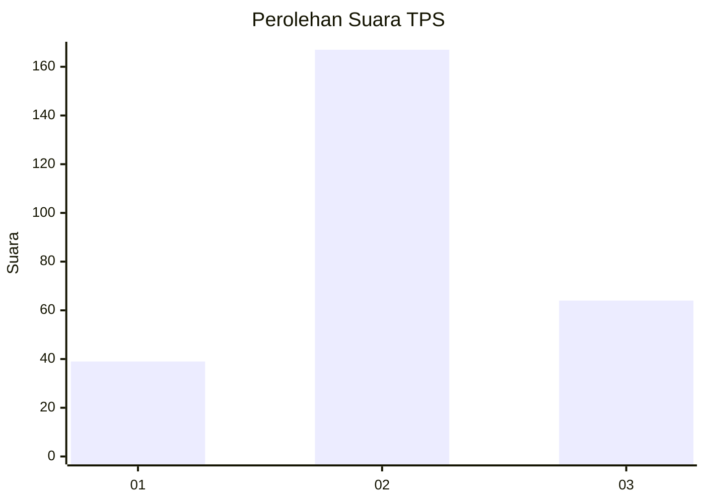
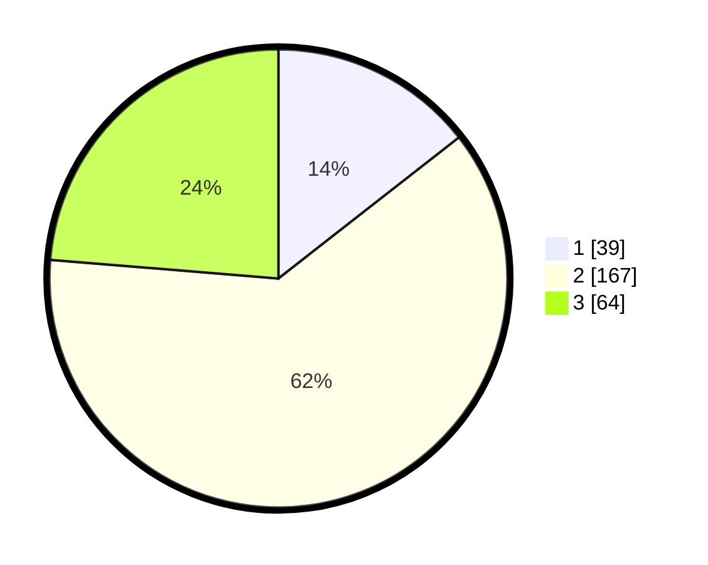

# Hasil

## Grafik

## Tabel

| No. | Nama Paslon    | Suara | Suara (raw) | Persentase |
|:--- |:-------------- | -----:| -----------:| ----------:|
| 1   | ANIES MUHAIMIN | 39    | [39][p-1]   | 14,44      |
| 2   | PRABOWO GIBRAN | 167   | [167][p-2]  | 61,85      |
| 3   | GANJAR MAHFUD  | 64    | [64][p-3]   | 23,70      |

[p-1]: https://github.com/gigit-pemilu/pemilu-2024-35-jawa-timur/blob/main/pilpres/hitung-suara/sub/35-jawa-timur/sub/79-kota-batu/sub/03-junrejo/sub/2007-torongrejo/sub/011-tps/sub/paslon-1.txt
[p-2]: https://github.com/gigit-pemilu/pemilu-2024-35-jawa-timur/blob/main/pilpres/hitung-suara/sub/35-jawa-timur/sub/79-kota-batu/sub/03-junrejo/sub/2007-torongrejo/sub/011-tps/sub/paslon-2.txt
[p-3]: https://github.com/gigit-pemilu/pemilu-2024-35-jawa-timur/blob/main/pilpres/hitung-suara/sub/35-jawa-timur/sub/79-kota-batu/sub/03-junrejo/sub/2007-torongrejo/sub/011-tps/sub/paslon-3.txt

## Foto C Plano

https://sirekap-obj-formc.kpu.go.id/e153/pemilu/ppwp/35/79/03/20/07/3579032007011-20240219-161805--19cae67d-2685-497e-9a1e-8bcac739222e.jpg

https://sirekap-obj-formc.kpu.go.id/e153/pemilu/ppwp/35/79/03/20/07/3579032007011-20240219-161858--66367771-59b8-46a0-a955-e1d3f4b2b142.jpg

https://sirekap-obj-formc.kpu.go.id/e153/pemilu/ppwp/35/79/03/20/07/3579032007011-20240219-161950--7a25e3fb-4aa2-499d-b722-1cbf0286b28d.jpg

## Metadata

| Key        | Value               |
| ---------- | ------------------- |
| Time Stamp | 2024-02-24 22:31:28 |

